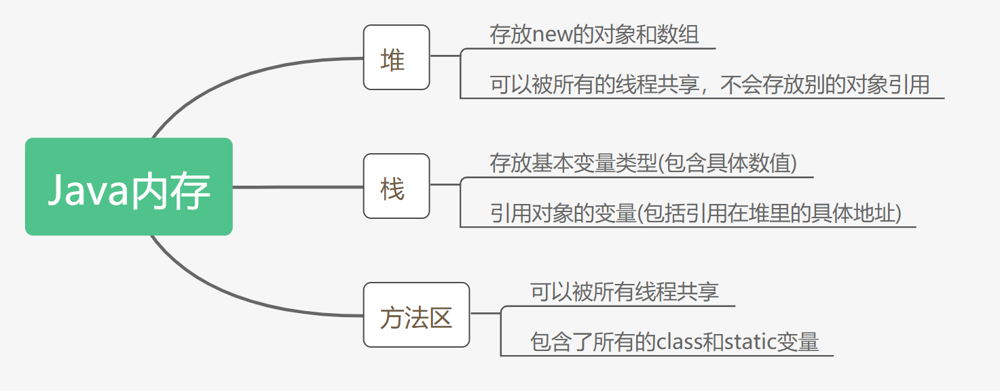
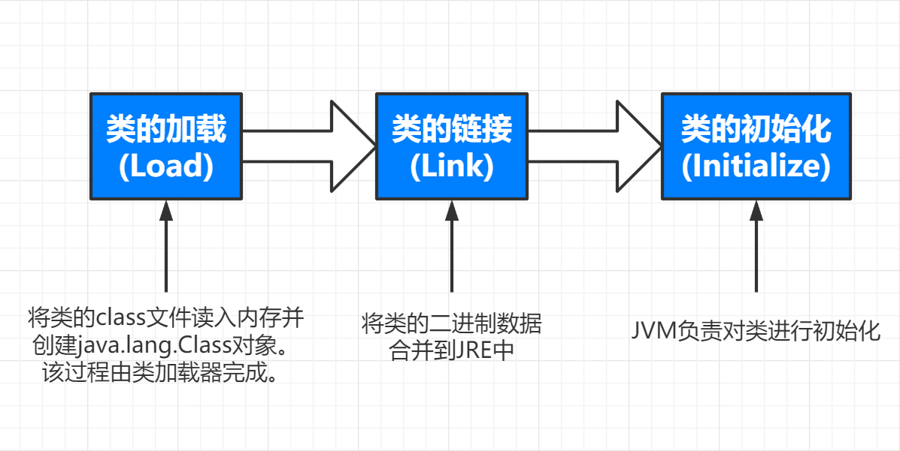
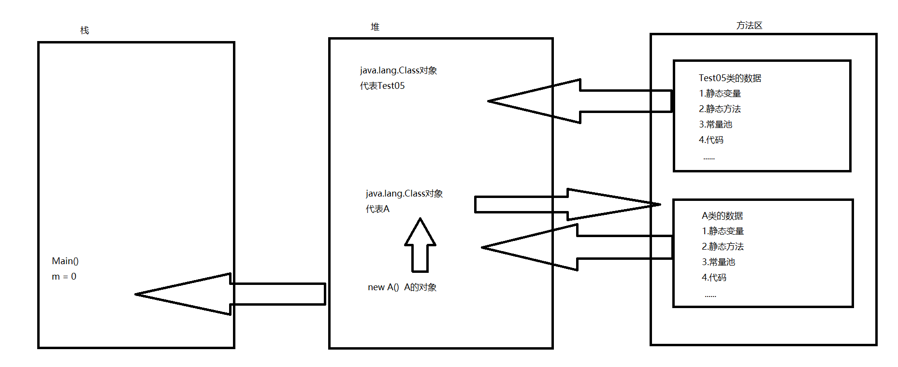

# Java 注解和反射

## 1.什么是注解

### 1.1注解入门

##### 注解起源

annotation 从JDK5.0开始引入

##### 注释和注解

comment 注释 

- 不是程序本身，给人解释程序

annotation 注解

- 不是程序本身，可以对程序作出解释
- **可以被其他程序(编译器)读取**,通过反射读取

##### 注解的格式

@注释名 可以添加参数值

```java
@SuppressWarnings(value="unchecked")
```

@Deprecated 已废弃的，可以写在不推荐使用的方法前


##### 注解在哪里使用

可以添加在package，class，method，field等上面，相当于添加了额外的信息

通过反射机制进行编程来实现对这些元数据的访问

##### 代码

```java
public class Test01 extends Object{
    //重写的注解
    @Override
    Public String toString{ //注解有检查的约束，如果上面的toString写的与父类不一致就会报错
        return super.toString();
    }
}
```

### 1.2内置注解

##### 三个内置注解

以下三个注解定义在`java.lang`下，例如@Override在`java.lang.Override`以此类推。

- @Override - 检查该方法是否是重写方法，没有重写会报编译错误。只适用于修饰方法。
- @Deprecated - 标记过时方法，不鼓励程序员使用，因为危险或存在更好的选择。如果使用该方法，会报编译警告。可以用来修饰方法，属性，类。
- @SuppressWarnings - 指示编译器去忽略注解中声明的警告。该注释需要添加参数。
  - @SuppressWarnings("all")
  - @SuppressWarnings("unchecked")
  - @SuppressWarnings(value={"unchecked","deprecation"})
  - ......

### 1.3元注解，自定义注解

##### 元注解

meta-annotation 元注解：负责注解其他注解。可以在`java.lang.annotation`包中找到下面4个类型和它们做支持的类。

- **@Target** - 描述注解的使用范围(注解可以用在什么地方)
- **@Retention** - 表示需要在什么样的级别保存该注解信息，描述注解的生命周期(SOURCE<CLASS<**RUNTIME**) 常用
- @Documented - 标记这些注解是否包含在用户文档中。
- @Inherited - 标记这个注解是继承于哪个注解类(默认 注解并没有继承于任何子类) 子类可以继承父类的该注解

##### 自定义注解

- 使用@interface来声明注解 格式public @interface 注解名 {注解内容}
- 其中的每一个方法其实是声明了一个配置参数
- 方法的名称就是参数的名称
- 返回值的类型就是参数的类型  返回值只能是基本类型class，String，enum
- 可以通过default来声明默认的参数值
- 如果只有一个参数，一般参数名为value
- 注解元素必须要有值，我们定义注解时一般使用空字符串或0作为默认值

```java
@ MyAnnotation
public class Test02{
    
    public test(){
        
    }
}
//定义注解
@Target(value = {ElementType.METHOD,ElementType.TYPE})
@Retention(RetentionPolicy.RUNTIME)
@Documented
@Inherited
@interface MyAnnotation{
    //仅使用元注解配置
}
```

##### 代码

```java
public class Test03 {
    //注解可以显示赋值，如果没有默认值，就必须赋值
    @MyAnnotation2(name = "李华")
    public void test(){

    }
    // 只有一个参数且名为value时可以省略参数名
    @MyAnnotation3("李华")
    public void test2(){

    }
}

@Target({ElementType.TYPE,ElementType.METHOD})
@Retention(RetentionPolicy.RUNTIME)
@interface MyAnnotation2{
    //这是注解的参数 格式：参数类型 + 参数名 + ();
    String name() default "";
    String[] schools() default {""};
}

@Target({ElementType.TYPE,ElementType.METHOD})
@Retention(RetentionPolicy.RUNTIME)
@interface MyAnnotation3{
    //如果只有一个参数，建议使用value
    String value();
}
```

## 2.反射机制

Java是静态语言，反射机制使得Java成为准动态语言

### 2.1Java反射机制概述

##### 静态语言与动态语言

静态语言：在运行时可以改变其结构的语言

动态语言：在运行时不能改变其结构的语言

Java是静态语言，使用反射机制可以让Java获得类似于动态语言的特性。

##### Reflection 反射

反射机制允许Java在程序执行期间借助Reflection API取得任何类的内部信息，并能操作任意对象的内部属性和方法

```java
Class c1 = Class.forName(java.lang.String);
```

加载完类之后，在堆内存的方法区中就产生了一个Class类型的对象(一个类只有一个Class对象)

这个对象包含了完整的类的结构信息，我们可以通过这个对象看到类的结构

这个对象就像一面镜子，透过这面镜子我们可以看到类的结构。所以形象地称之为：反射

正常方法： 引入"包类 "-----> new实例化 -----> 获得实例化对象

反射方法：实例化对象 -----> getClass()方法 -----> 获得完整的"包类"名称

##### Java反射机制提供的功能

- 在运行时判断任意一个对象所属的类  
- 在运行时构造任意一个类的对象  
- 在运行时判断任意一个类所具有的成员变量和方法  
- 在运行时获取泛型信息  
- 在运行时调用任意一个对象的成员变量和方法  
- 在运行时处理注解  
- 生成动态代理 (AOP面向切面编程)
- ......

##### 反射的优点和缺点

优点：可以实现动态创建对象和编译，灵活。

缺点：影响性能，反射是一种解释操作，我们需要告诉JVM我们希望做什么，并让它满足我们的要求，这样的操作总是慢于直接执行相同的操作。

##### 反射相关的主要API

`java.lang.Class` 代表一个类

`java.lang.reflect.Method` 代表类的方法

`java.lang.reflect.Field ` 代表类的属性

`java.lang.reflect.Constructor` 代表类的构造器

##### 获取反射对象

```jave
//通过反射获取类的Class对象
Class c1 = Class.forName("com.lee.reflection.User");
```

### 2.2理解Class类并获取Class实例

##### Class类

在Object类中有如下方法，该方法被所有子类继承

```java
public final Class getClass()
```

返回的Class类是Java反射的源头。

对象照镜子(即getClass()方法)后可以得到的信息:某个类的属性、方法和构造器、某个类到底实现了哪些接口  对于每个类而言,JRE都为其保留一个不变的 Class类型的对象。一个 Class对象包含了特  定某个结构的有关信息。

- Class本身也是一个类  
- Class对象只能由系统建立对象  
- 一个加载的类在JVM中只会有一个Class实例  
- 一个 Class对象对应的是一个加载到JVM中的一个class文件  
- 每个类的实例都会记得自己是由哪个Class实例所生成  
- 通过 Class可以完整地得到一个类中的所有被加载的结构  
- Class类是Reflection的根源,针对任何你想动态加载、运行的类,唯有先获得相应的Class对象

##### Class类的常用方法

static Class.forName(String name)

Object newInstance()

getName()

Class getSuperclass()

Class getInterface()

ClassLoader getClassLoader()

Constructor[] getConstructors()

Method getMethod(String name,Class.. T)

Field[] getDeclaredFields() 

##### 获取Class类的实例

1. 已知具体类通过类的class属性获取，安全可靠，性能最高

   ```java
   Class c = Person.class;
   ```

2. 已知某个类的实例，调用getClass()方法获取Class对象

   ```java
   Class c = person.getClass();
   ```

3. 已知一个类的全类名，且该类在类路径下，可以用Class类的静态方法forName()获取，可能抛出异常`ClassNotFoundException`

   ```java
   Class c = Class.forName("com.lee.Student");
   ```

4. 内置基本数据类型可以使用类名.TYPE

   ```
   Class c = Integer.TYPE;
   ```

5. 使用`ClassLoader`，详见2.3

##### 哪些类型可以有Class对象

- class 类
- interface 接口
- [] 数组
- enum 枚举
- annotation 注解
- primitive type 基本数据类型
- void

### 2.3类的加载与`ClassLoader`

##### Java内存分析



方法区是堆的一个逻辑部分，内存上属于堆但为了区分又叫非堆 

##### 类加载过程

当程序主动使用某个类时，如果该类还未被加载到内存中，则系统会通过如下三个步骤对该类进行初始化



**加载**：将class文件字节码内容加载到内存中，并将这些静态数据转换成方法区的运行时数据结构，然后生成一个代表这个类的`java.lang.Class`对象。

**链接**:将ava类的二进制代码合并到JVM的运行状态之中的过程。

- 验证:确保加载的类信息符合JVM规范没有安全方面的问题
- 准备:正式为类变量(static)分配内存并设置类变量默认初始值的阶段,这些内存都将在方法区中进行分配。
- 解析:虚拟机常量池内的符号引用(常量名)替换为直接引用(地址)的过程。

**初始化**：执行类构造器< clinit>()方法的过程。

- 类构造器< clinit>()方法是由编译期自动收集类中所有类变量的赋值动作和静态代码块中的语句合并产生的。(类构造器是构造类信息的,不是构造该类对象的构造器)    
- 当初始化一个类的时候,如果发现其父类还没有进行初始化,则需要先触发其父类的初始化。    
- 虚拟机会保证一个类的方法在多线程环境中被正确加锁和同步

##### 例子

```java
public class Test05 {
    public static void main(String[] args) {
        A a = new A();
        System.out.println(A.m);

        /*
        1.加载到内存，产生一个Class对象
        2.链接 结束后m = 0
        3.初始化
            <clinit>(){
            static{
        System.out.println("A静态代码块初始化");
        m = 300;
        m = 100;
        }
         */
    }
}

class A{
    static{
        System.out.println("A静态代码块初始化");
        m = 300;
    }
    static int m = 100;

    public A(){
        System.out.println("A的无参构造器");
    }
}
```

##### 分析图



##### 类初始化

**类的主动引用(一定会发生类的初始化)**

- 当虚拟机启动,先初始 main方法所在的类
- 调用类的静态成员(除了final常量)和静态方法
- 使用`java.lang.reflect`包的方法对应类进行反射调用
- 当初始化一个类,如果其父类没有被初始化,则先会初始化它的父类

**类的被动引用(不会发生类的初始化)**

- 当访问一个静态域时,只有真正声明这个域的类才会被初始化。如:当通过子类引用父类的静态变量,不会导致子类初始化
- 通过数组定义类引用,不会触发此类的初始化
- 引用常量不会触发此类的初始化(常量在链接阶段就存入调用类的常量池中了)

##### 类加载器

Java 中的类加载器大致可以分成两类，一类是系统提供的，另外一类则是由 Java 应用开发人员编写的。系统提供的类加载器主要有下面三个：

- 引导类加载器（bootstrap class loader）：它用来加载 Java 的核心库，是用原生代码来实现的，并不继承自 `java.lang.ClassLoader` 。
- 扩展类加载器（extensions class loader）：它用来加载 Java 的扩展库。Java 虚拟机的实现会提供一个扩展库目录。该类加载器在此目录里面查找并加载 Java 类。
- 系统类加载器（system class loader）：它根据 Java 应用的类路径（CLASSPATH）来加载 Java 类。一般来说，Java 应用的类都是由它来完成加载的。可以通过 `ClassLoader.getSystemClassLoader()` 来获取它。

除了系统提供的类加载器以外，开发人员可以通过继承 `java.lang.ClassLoader` 类的方式实现自己的类加载器，以满足一些特殊的需求。

##### 双亲委派机制

当一个`Hello.class`这样的文件要被加载时。不考虑我们自定义类加载器，首先会在`AppClassLoader`(即system class loader)中**检查是否加载过**，如果有那就无需再加载了。如果没有，那么会拿到**父加载器**，然后调用父加载器的**loadClass**方法。父类中同理会先检查自己是否已经加载过，如果没有再往上。注意这个过程，知道到达**Bootstrap classLoader**之前，都是没有哪个加载器自己选择加载的。如果父加载器无法加载，会下沉到子加载器去加载，一直到最底层，如果没有任何加载器能加载，就会抛出**ClassNotFoundException**。
**为什么要设计这种机制?**
这种设计有个好处是，如果有人想替换系统级别的类：String.java。篡改它的实现，但是在这种机制下这些系统的类已经被Bootstrap classLoader加载过了，所以并不会再去加载，从一定程度上防止了危险代码的植入。

### 2.4创建运行时类的对象

##### 获取运行时类结构

获取运行时类的**完整结构**或**指定结构**

通过反射获取运行时类的完整结构:

Field，Method，Constructor，Superclass，Interface，Annotation

**代码**

```java
public class Test08 {
    public static void main(String[] args) throws ClassNotFoundException,NoSuchFieldException,NoSuchMethodException{
        Class c1 = Class.forName("com.lee.reflection.User");
        /*
        User user = new User();
        c1 = user.getClass();
        */
        //获得类的名字
        System.out.println(c1.getName());// 包名 + 类名
        System.out.println(c1.getSimpleName());// 类名

        //获得类的属性
        System.out.println("===============================");
        Field[] fields = c1.getFields();//只能找到public方法
        for(Field field : fields){
            System.out.println(field);
        }

        Field[] declaredFields = c1.getDeclaredFields();//找到所有方法
        for(Field field : declaredFields){
            System.out.println(field);
        }
        //获得指定属性的值
        Field name = c1.getDeclaredField("name");
        System.out.println(name);

        //获得类的方法
        System.out.println("===============================");
        Method[] methods = c1.getMethods(); // 获得本类及父类的全部public方法
        for (Method method : methods) {
            System.out.println("正常的:" + method);
        }
        Method[] declaredMethods = c1.getDeclaredMethods();//获得本类的所有方法
        for (Method declaredMethod : declaredMethods) {
            System.out.println("Declared" + declaredMethod);
        }

        //获得指定的方法
        Method getName = c1.getMethod("getName", null);
        System.out.println(getName);
        Method setName = c1.getMethod("setName", String.class);
        System.out.println(setName);

        //获得指定的构造器
        System.out.println("===============================");
        Constructor[] constructors = c1.getConstructors(); // 获得public构造器
        for (Constructor constructor : constructors) {
            System.out.println(constructor);
        }

        Constructor[] declaredConstructors = c1.getDeclaredConstructors();// 获得全部的构造器
        for (Constructor declaredConstructor : declaredConstructors) {
            System.out.println("$ "+ declaredConstructor);
        }

        //获得指定的构造器
        Constructor declaredConstructor = c1.getDeclaredConstructor(String.class, int.class, int.class);
        System.out.println("指定 " + declaredConstructor);

    }
}
```

**代码中的User类**

```java
class User {
    private String name;
    private int id;
    private int age;

    public User(String name, int id, int age) {
        this.name = name;
        this.id = id;
        this.age = age;
    }

    public User() {
    }

    public String getName() {
        return name;
    }

    public void setName(String name) {
        this.name = name;
    }

    public int getId() {
        return id;
    }

    public void setId(int id) {
        this.id = id;
    }

    public int getAge() {
        return age;
    }

    public void setAge(int age) {
        this.age = age;
    }

    @Override
    public String toString() {
        return "User{" +
                "name='" + name + '\'' +
                ", id=" + id +
                ", age=" + age +
                '}';
    }
}
```

##### 动态创建对象执行方法

**创建对象**：

调用Class对象的`newInstance()`方法

1. 类必须有无参构造器
2. 类的构造器必须有足够的权限

如果没有无参构造器，我们需要明确调用类中的构造器，并将参数传递进去，进行实例化。

1. 通过Class类的`getDeclaredConstructor(Class...parameterTypes)`获取本类指定形参构造器
2. 向构造器的形参中传递一个对象数组进去，里面包含了构造器所需的参数
3. 通过Constructor来实例化对象

**调用指定方法**

通过反射，调用类中的方法，通过Method类完成

1. 通过Class类的`getMethod(...)`方法获取Method对象，并设置操作此方法时所需参数类型。
2. 之后使用`Object invoke(...)`进行调用，并传递object对象的参数信息。

```java
Object invoke(Object obj, Object ... args)
```

- Object对应原方法的返回值，若无返回值则返回null
- 原方法若为静态方法，则形参Object `obj`可为null
- 原方法的参数列表为空，则Object[] `args`可为null
- 原方法声明为private则需要在调用`invoke()`前，显式调用方法对象的`setAccessible(true)`方法，然后可以访问private

`SetAccessible`

- Method，Field，Constructor对象都有`SetAccessible`方法
- `SetAccessible`方法的作用是启用或禁用安全访问检查的开关
- 参数设置为true，反射对象取消Java语言访问检查
  - 提高反射效率，反射代码频繁调用，设置为true可以提示效率
  - 使得原本无法访问的私有成员也可以访问
- 参数设置为false，反射对象实施Java语言访问检查

**代码**

```java
//通过反射动态地创建对象
public class Test09 {
    public static void main(String[] args) throws ClassNotFoundException, IllegalAccessException, InstantiationException, NoSuchMethodException, InvocationTargetException, NoSuchFieldException {
        //获得Class对象
        Class c1 = Class.forName("com.lee.reflection.User");
        //构造一个user对象
        User user = (User)c1.newInstance(); //本质是调用无参构造器 没有的话会报错
        System.out.println(user);

        //通过构造器创建对象
        Constructor declaredConstructor = c1.getDeclaredConstructor(String.class, int.class, int.class);
        User user2 = (User)declaredConstructor.newInstance("李华", 001, 18);
        System.out.println(user2);

        //通过反射调用普通方法
        User user3 = (User)c1.newInstance();
        //通过反射获取一个方法
        Method setName = c1.getDeclaredMethod("setName", String.class);
        //invoke 激活
        // (对象 ," 方法的值")
        setName.invoke(user3,"李明");
        System.out.println(user3.getName());

        //通过反射操作属性
        User user4 = (User)c1.newInstance();
        Field name = c1.getDeclaredField("name");

        //不能直接操作私有属性，我们需要关闭程序的安全检测
        //属性或方法 的setAccessible()方法设为true
        name.setAccessible(true);
        name.set(user4,"lee");
        System.out.println(user4.getName());
    }
}
```

User类前面已给出

##### 获取泛型信息

- Java采用泛型擦除的机制来引入泛型,Java中的泛型仅仅` javac`是给编译器使用的,确保数据的安全性和免去强制类型转换问题,但是,一旦编译完成,所有和泛型有关的类型全部擦除
- 为了通过反射操作这些类型,Java新增了` ParameterizedType`, `GenericArrayType`,`TypeVariable`和 `WildcardType`几种类型来代表不能被归一到 Class类中的类型但是又和原  始类型齐名的类型

- `ParameterizedType`:表示一种参数化类型,比如Collection<String>
- `GenericArrayType`:表示一种元素类型是参数化类型或者类型变量的数组类型    
- `TypeVariable`:是各种类型变量的公共父接口
- `WildcardType`:代表一种通配符类型表达式

**获取步骤**

1. 获取当前类

2. 获取目标字段

3. 获取包含泛型类型的类型 `getGenericType()`

4. 强转至子类`ParameterizedType`因为Type没有任何对应的方法

5. 获得泛型真正的类型`getActualTypeArguments()`


**代码**

```java
//通过反射获取泛型
public class Test10 {
    public void test01(Map<String,User> map, List<User> list){
        System.out.println("test01");
    }

    public Map<String,User> test02(){
        System.out.println("test02");
        return null;
    }

    public static void main(String[] args) throws NoSuchMethodException {

        Method method = Test10.class.getMethod("test01", Map.class, List.class);

        Type[] genericParameterTypes = method.getGenericParameterTypes();
        for (Type genericParameterType : genericParameterTypes) {
            System.out.println("#" + genericParameterType);
            if (genericParameterType instanceof ParameterizedType){
                Type[] actualTypeArguments = ((ParameterizedType) genericParameterType).getActualTypeArguments();
                for (Type actualTypeArgument : actualTypeArguments) {
                    System.out.println(actualTypeArgument);
                }
            }
        }

        method = Test10.class.getMethod("test02",null);
        Type genericReturnType = method.getGenericReturnType();
        if (genericReturnType instanceof ParameterizedType){
            Type[] actualTypeArguments = ((ParameterizedType) genericReturnType).getActualTypeArguments();
            for (Type actualTypeArgument : actualTypeArguments) {
                System.out.println(actualTypeArgument);
            } 
        }
    }
}

```

##### 获取注解信息

ORM 

Object Relationship Mapping  对象关系映射

- 类和表结构对应
- 属性和字段对应
- 对象和记录对应

利用注解和反射完成类和表的结构的映射关系

```java
//获取注解的信息
public class Test11 {

    public static void main(String[] args) throws ClassNotFoundException, NoSuchFieldException {
        Class c = Class.forName("com.lee.reflection.Student2");
        //通过反射获得注解
        Annotation[] annotations = c.getAnnotations();
        for (Annotation annotation : annotations) {
            System.out.println(annotation);
        }
        //通过反射获得注解的value的值
        MyTable table = (MyTable)c.getAnnotation(MyTable.class);
        String value = table.value();
        System.out.println(value);

        //获得类指定的注解
        Field field = c.getDeclaredField("name");
        MyField annotation = field.getAnnotation(MyField.class);
        System.out.println(annotation.columnName());
        System.out.println(annotation.length());
        System.out.println(annotation.type());
    }

}
@MyTable("db_student")
class Student2{
    @MyField(columnName = "db_id",type = "int",length = 10)
    private int id;
    @MyField(columnName = "db_age",type = "int",length = 10)
    private int age;
    @MyField(columnName = "db_name",type = "varchar",length = 3)
    private String name;

    public Student2() {
    }

    public Student2(int id, int age, String name) {
        this.id = id;
        this.age = age;
        this.name = name;
    }

    public int getId() {
        return id;
    }

    public void setId(int id) {
        this.id = id;
    }

    public int getAge() {
        return age;
    }

    public void setAge(int age) {
        this.age = age;
    }

    public String getName() {
        return name;
    }

    public void setName(String name) {
        this.name = name;
    }

    @Override
    public String toString() {
        return "Student2{" +
                "id=" + id +
                ", age=" + age +
                ", name='" + name + '\'' +
                '}';
    }
}

//类名的注解
@Target(ElementType.TYPE)
@Retention(RetentionPolicy.RUNTIME)
@interface MyTable{
    String value();
}

//属性的注解
@Target(ElementType.FIELD)
@Retention(RetentionPolicy.RUNTIME)
@interface MyField{
    String columnName();
    String type();
    int length();
}
```
