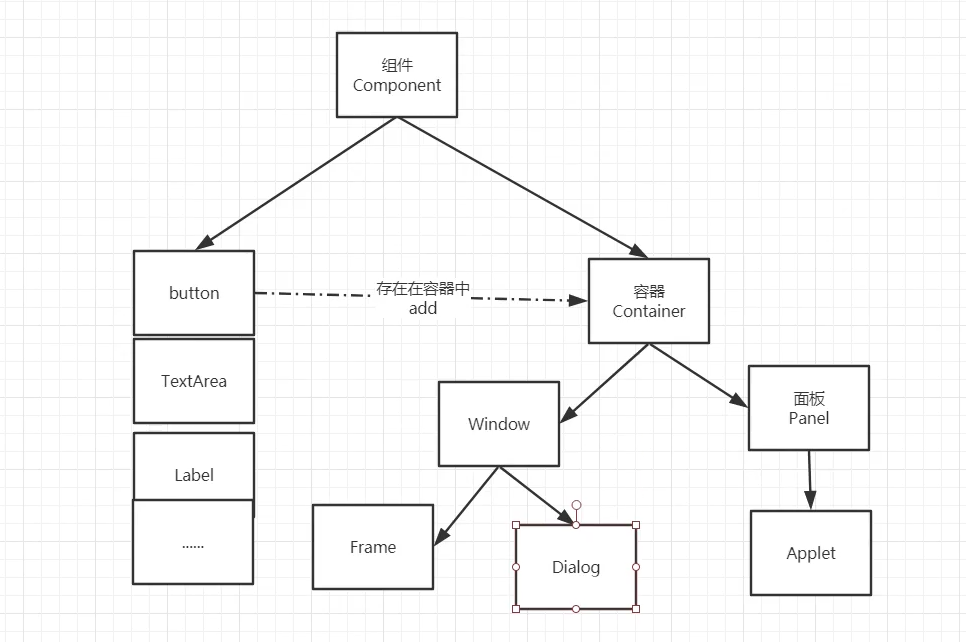
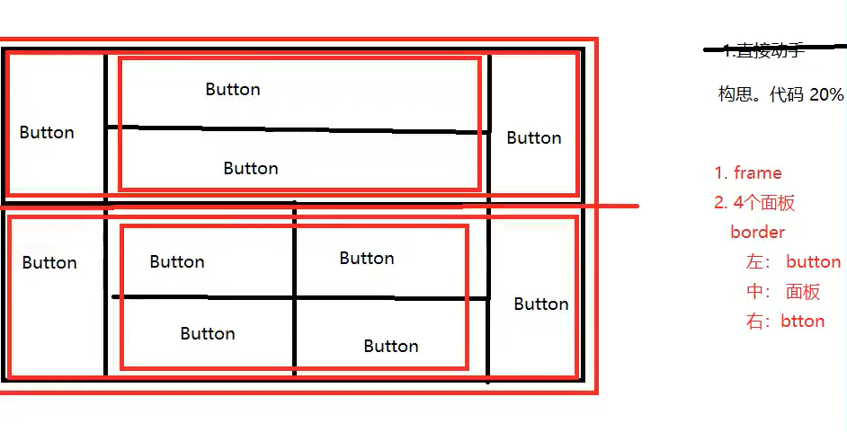

# GUI编程

## 前言

学一个东西：

- 它是什么
- 怎么运行
- 如何应用

组件

- 窗口
- 弹窗
- 面板
- 文本框
- 列表框
- 按钮
- 图片
- 监听事件
- 鼠标
- 键盘事件
- 破解工具

## 1 简介

GUI核心技术：Swing AWT

但并不流行，甚至快要被淘汰：

- 界面不美观
- 需要JRE环境

为什么我们还要学习？

1. 自娱自乐
2. 了解MVC框架，了解监听

## 2 AWT

### 2.1 AWT介绍

AWT Abstract Windows Tools 抽象窗口工具

GUI Graphical User Interface 图形用户接口

1. 包含了许多类和接口
2. 元素：窗口，文本框，按钮
3. java.awt包




### 2.2 组件和容器

#### Frame

```java
//GUI的第一个界面
public class TestFrame {
    public static void main(String[] args) {
        //使用时要学会点进去看源码
        Frame frame = new Frame("我的第一个Java图像界面");

        //需要设置可见性
        frame.setVisible(true);

        //设置窗口大小
        frame.setSize(400,400);

        //设置背景颜色
        //new Color(1,1,1);//自定义颜色
        frame.setBackground(Color.BLACK);

        //弹出的初始位置，（0，0）在左上角
        frame.setLocation(200,200);

        //设置大小固定
        frame.setResizable(false);
        
    }
}
```

发现问题：程序无法关掉。方法：停止程序运行。

回顾封装：产生多个窗口

```java
public class TestFrame2 {
    public static void main(String[] args) {

        MyFrame myFrame1 = new MyFrame(100, 100, 200, 200, Color.BLUE);
        MyFrame myFrame2 = new MyFrame(300, 100, 200, 200, Color.CYAN);
        MyFrame myFrame3 = new MyFrame(100, 300, 200, 200, Color.GREEN);
        MyFrame myFrame4 = new MyFrame(300, 300, 200, 200, Color.ORANGE);
    }
}

class MyFrame extends Frame{
    //可能存在多个窗口，我们需要一个计数器
    static int count = 0;

    public MyFrame(int x,int y,int w,int h,Color color){
        super("MyFrame"+(++count));

        setBounds(x, y, w, h);
        setVisible(true);
        setBackground(color);
    }
}
```

#### Panel

面板不能单独存在，在容器里面，可以看成是一个空间

下面的代码解决了关闭事件

```java
//Panel可以看成是一个空间，但不能单独存在
public class TestPanel {
    public static void main(String[] args) {
        Frame frame = new Frame();
        //布局的概念
        Panel panel = new Panel();

        //设置布局
        frame.setLayout(null);

        //坐标
        frame.setBounds(300,300,500,500);
        frame.setBackground(new Color(96, 255, 29, 255));

        //Panel设置坐标，相对于frame
        panel.setBounds(50,50,400,400);
        panel.setBackground(new Color(0, 82, 255));

        //放进frame
        frame.add(panel);
        frame.setVisible(true);

        //监听事件，监听窗口关闭事件 System.exit(0);
        //适配器模式 不去new WindowListener 实现太全部的接口
        //而是去继承它的一个子类，子类有默认的实现，我们只写我们需要的那个功能

        //这是AWT的解决方式，后面还有swing的解决方式
        frame.addWindowListener(new WindowAdapter() {
            //窗口点击关闭的时候需要做的事情
            @Override
            public void windowClosing(WindowEvent e) {
                //结束程序
                System.exit(0);
            }
        });

    }
}
```

### 2.3 布局管理器

##### 三种布局

- 流式布局

  ```java
  public class TestFlowLayout {
      public static void main(String[] args) {
          Frame frame = new Frame();
          //组件 按钮
          Button button1 = new Button("button1");
          Button button2 = new Button("button2");
          Button button3 = new Button("button3");
  
          //设置流式布局 居中 靠左 靠右 等等
          frame.setLayout(new FlowLayout());
          //frame.setLayout(new FlowLayout(FlowLayout.LEFT));
          //frame.setLayout(new FlowLayout(FlowLayout.RIGHT));
  
          frame.setSize(200,200);
          //添加按钮
          frame.add(button1);
          frame.add(button2);
          frame.add(button3);
  
          frame.setVisible(true);
      }
  }
  ```

- 东西南北中

  ```java
  public class TestBorderLayout {
      public static void main(String[] args) {
          Frame frame = new Frame("BorderLayout");
  
          Button button1 = new Button("East");
          Button button2 = new Button("West");
          Button button3 = new Button("South");
          Button button4 = new Button("North");
          Button button5 = new Button("Center");
  
          frame.add(button1,BorderLayout.EAST);
          frame.add(button2,BorderLayout.WEST);
          frame.add(button3,BorderLayout.SOUTH);
          frame.add(button4,BorderLayout.NORTH);
          frame.add(button5,BorderLayout.CENTER);
  
          frame.setSize(200,200);
          frame.setVisible(true);
  
      }
  }
  ```

- 表格布局 Gird 

  ```java
  public class TestGirdLayout {
      public static void main(String[] args) {
          Frame frame = new Frame();
  
          Button button1 = new Button("1");
          Button button2 = new Button("2");
          Button button3 = new Button("3");
          Button button4 = new Button("4");
          Button button5 = new Button("5");
          Button button6 = new Button("6");
  
          frame.setLayout(new GridLayout(3,2));
  
          frame.add(button1);
          frame.add(button2);
          frame.add(button3);
          frame.add(button4);
          frame.add(button5);
          frame.add(button6);
  
          frame.pack(); // Java方法，自动选择最优布局 也无需设计大小
          //frame.setSize(200,200);
          frame.setVisible(true);
  
      }
  }
  ```


##### 布局练习

通过不同布局的嵌套我们可以设计出我们想要的布局，下面是一个练习




##### 布局解答

```java
public class Demo {
    public static void main(String[] args) {
        Frame frame = new Frame();
        frame.setSize(400,300);
        frame.setLocation(300,400);
        frame.setBackground(Color.BLACK);
        frame.setVisible(true);
        frame.setLayout(new GridLayout(2,1));

        //4个面板
        Panel panel1 = new Panel(new BorderLayout());
        Panel panel2 = new Panel(new GridLayout(2,1));
        Panel panel3 = new Panel(new BorderLayout());
        Panel panel4 = new Panel(new GridLayout(2,1));

        //上面
        panel1.add(new Button("East-1"),BorderLayout.EAST);
        panel1.add(new Button("East-2"),BorderLayout.WEST);
        panel2.add(new Button("p2-btn-1"));
        panel2.add(new Button("p2-btn-2"));
        panel1.add(panel2,BorderLayout.CENTER);

        //下面
        panel3.add(new Button("East-1"),BorderLayout.EAST);
        panel3.add(new Button("East-2"),BorderLayout.WEST);
        //中间的四个
        for (int i = 0; i < 4; i++) {
            panel4.add(new Button("btn"+i));
        }
        panel3.add(panel4,BorderLayout.CENTER);

        frame.add(panel1);
        frame.add(panel3);
    }
}
```

##### 总结

1. Frame是一个顶级窗口
2. Panel无法单独显示，必须添加到某个容器中。
3. 三种布局管理器
4. 设置 大小，颜色，位置，可见性，监听

### 2.4 事件监听

事件监听

按下按钮打印一行字符串

```java
public class TestAction {
    public static void main(String[] args) {
        //按下按钮，触发一些事件
        Frame frame = new Frame();
        Button button = new Button();
        //addActionListener()方法需要一个ActionListener，我们构建了一个MyActionListener类
        MyActionListener myActionListener = new MyActionListener();
        button.addActionListener(myActionListener);

        frame.add(button,BorderLayout.CENTER);
        frame.pack();
        windowClose(frame);//窗口可以关闭
        frame.setVisible(true);

    }

    //关闭窗体的事件
    private static void windowClose(Frame frame){
        frame.addWindowListener(new WindowAdapter() {
            @Override
            public void windowClosing(WindowEvent e) {
                System.exit(0);
            }
        });
    }
}
//事件监听
class MyActionListener implements ActionListener{
    @Override
    public void actionPerformed(ActionEvent e) {
        System.out.println("aaa");
    }
}
```

两个按钮，共享一个事件

```java
public class TestAction02 {
    public static void main(String[] args) {
        //两个按钮实现同一个监听
        //开始    结束
        Frame frame = new Frame();

        Button button1 = new Button("start");
        Button button2 = new Button("stop");
		//可以显示地定义触发返回的命令
        //设置行为命令前button2参数为stop，设置后变更为button-2-stop
        button2.setActionCommand("button-2-stop");
        MyMonitor myMonitor = new MyMonitor();

        button1.addActionListener(myMonitor);
        button2.addActionListener(myMonitor);

        frame.add(button1,BorderLayout.NORTH);
        frame.add(button2,BorderLayout.SOUTH);

        frame.pack();
        frame.setVisible(true);

    }
}
class MyMonitor implements ActionListener{
    @Override
    public void actionPerformed(ActionEvent e) {

        //System.out.println("按钮被点击了：msg=> "+e.getActionCommand());
        if(e.getActionCommand().equals("start")){
            System.out.println("开始");
        }else{
            System.out.println("停止");
        }
    }
}
```

### 2.5 输入框

TextField

```java
public class TextField01 {
    public static void main(String[] args) {
        MyFrame myFrame = new MyFrame();

    }
}

class MyFrame extends Frame{
    public MyFrame(){
        //new TextArea();//多行文本
        TextField textField = new TextField();//单行文本
        add(textField);

        //监听这个文本框输入的文字
        MyActionListener myActionListener = new MyActionListener();
        //按下Enter 触发输入框的事件
        textField.addActionListener(myActionListener);
        //设置替换编码
        textField.setEchoChar('*');

        pack();
        setVisible(true);

    }

    class MyActionListener implements ActionListener{
        @Override
        public void actionPerformed(ActionEvent e) {
            //获得一些资源，返回的一个对象Object 监听谁就转为谁
            TextField field = (TextField) e.getSource();
            System.out.println(field.getText());//  获得输入框中的文本
            field.setText("");//Enter后清空输入框
        }
    }

}
```

### 2.6 计算器及回顾

实现一个简易的计算器，顺便回顾组合，内部类

组合是继承的另一种方式，OOP原则：组合大于继承

```java
public A extends B{
    //继承
}
public A{
    public B b;
    //组合，耦合性降低
}
```

#### 加法计算器

```java
//简易计算器
public class Calculator {
    public static void main(String[] args) {
        new Calc();
    }
}
//计算器类
class Calc extends Frame{
    public Calc(){
        //三个文本框
        TextField textField1 = new TextField(10);//最多写多少字符
        TextField textField2 = new TextField(10);
        TextField textField3 = new TextField(20);//比前两个长

        //一个按钮
        Button button = new Button("=");
        button.addActionListener(new MyCalculatorListener(textField1,textField2,textField3));
        //一个标签 展示+
        Label label = new Label("+");

        //布局 流式
        setLayout(new FlowLayout());

        add(textField1);
        add(label);
        add(textField2);
        add(button);
        add(textField3);

        pack();
        setVisible(true);
    }
}

//监听器类
class MyCalculatorListener implements ActionListener{

    //获取三个变量
    private TextField field1,field2,field3;
    public MyCalculatorListener(TextField field1,TextField field2,TextField field3){
        this.field1 = field1;
        this.field2 = field2;
        this.field3 = field3;

    }

    @Override
    public void actionPerformed(ActionEvent e) {
        //获得加数和被加数
        int i1 = Integer.parseInt(field1.getText());
        int i2 = Integer.parseInt(field2.getText());
        //相加后，放到第三个框
        field3.setText(""+(i1+i2));//暴力拼接成字符串
        //清除前两个框
        field1.setText("");
        field2.setText("");

    }
}
```

#### 优化

```java
//简易计算器
public class Calculator {
    public static void main(String[] args) {
        new Calc().loadFrame();
    }
}
//计算器类
class Calc extends Frame{
    //属性
    TextField textField1,textField2,textField3;
    //方法
    public void loadFrame(){
        //三个文本框
        textField1 = new TextField(10);//最多写多少字符
        textField2 = new TextField(10);
        textField3 = new TextField(20);//比前两个长
        //一个按钮
        Button button = new Button("=");
        button.addActionListener(new MyCalculatorListener(this));
        //一个标签 展示+
        Label label = new Label("+");
        //布局 流式
        setLayout(new FlowLayout());

        add(textField1);
        add(label);
        add(textField2);
        add(button);
        add(textField3);

        pack();
        setVisible(true);
    }
}

//监听器类
class MyCalculatorListener implements ActionListener{

    //在一个类中组合另一个类
    Calc calc = null;
    //没必要依次获取三个变量，直接把计算器类拿过来
    public MyCalculatorListener(Calc calc){
        this.calc = calc;
    }
    @Override
    public void actionPerformed(ActionEvent e) {
        //获得加数和被加数
        int i1 = Integer.parseInt(calc.textField1.getText());
        int i2 = Integer.parseInt(calc.textField2.getText());
        //相加后，放到第三个框
        calc.textField3.setText(""+(i1+i2));
        //清除前两个框
        calc.textField1.setText("");
        calc.textField2.setText("");
    }
}
```

#### 完全改造为OOP

多态，继承什么三大特性都不建议使用，在企业开发中：继承增强了耦合性，多态让代码更麻烦，理解可能有错误

更应该使用内部类

内部类：

- 更好的包装
- 内部类最大的好处就是可以畅通无阻地访问外部类的属性和方法

```java
//简易计算器
public class Calculator {
    public static void main(String[] args) {
        new Calc().loadFrame();
    }
}
//计算器类
class Calc extends Frame{
    //属性
    TextField textField1,textField2,textField3;
    //方法
    public void loadFrame(){
        //三个文本框
        textField1 = new TextField(10);//最多写多少字符
        textField2 = new TextField(10);
        textField3 = new TextField(20);//比前两个长
        //一个按钮
        Button button = new Button("=");
        button.addActionListener(new MyCalculatorListener());
        //一个标签 展示+
        Label label = new Label("+");
        //布局 流式
        setLayout(new FlowLayout());

        add(textField1);
        add(label);
        add(textField2);
        add(button);
        add(textField3);

        pack();
        setVisible(true);
    }
    //内部类最大的好处就是可以畅通无阻地访问外部类的属性和方法
    private class MyCalculatorListener implements ActionListener{

        @Override
        public void actionPerformed(ActionEvent e) {
            //获得加数和被加数
            int i1 = Integer.parseInt(textField1.getText());
            int i2 = Integer.parseInt(textField2.getText());
            //相加后，放到第三个框
            textField3.setText(""+(i1+i2));
            //清除前两个框
            textField1.setText("");
            textField2.setText("");
        }
    }
}
```

### 2.7 画笔

```java
public class TestPaint {
    public static void main(String[] args) {
        //我们只调用了loadFrame，但是子类重写父类的方法也被执行了
        new MyPaint().loadFrame();
    }
}
class MyPaint extends Frame {

    public void loadFrame(){

        setBounds(200,200,600,500);
        setVisible(true);

    }

    @Override
    public void paint(Graphics g){
        //画笔可以有颜色，可以画画
        g.setColor(Color.red);
        //空心圆
        g.drawOval(100,100,100,100);
        //实心圆
        g.fillOval(100,100,100,100);
        g.setColor(Color.BLUE);
        g.fillRect(150,200,200,200);
        //养成习惯画笔用完，将它还原到最初的颜色 黑色
        g.setColor(Color.BLACK);

    }
}
```

每隔一段时间就重写画，可以构成动画

### 2.8 鼠标监听

目标：实现鼠标画画(点)

```java
public class TestMouseListener {
    public static void main(String[] args) {
        new MyFrame("画图");
    }
}
class MyFrame extends Frame{
    //画画需要画笔，需要监听鼠标当前的位置，需要集合来存储这个点
    private ArrayList points;

    public MyFrame(String title){
        super(title);
        setBounds(200,200,400,300);
        setVisible(true);
        //存鼠标点击的点
        points = new ArrayList<>();

        //鼠标监听器，针对这个窗口
        this.addMouseListener(new MyMouseListener());
    }

    @Override
    public void paint(Graphics g) {
        //画画，监听鼠标事件
        Iterator iterator = points.iterator();
        while(iterator.hasNext()){
            Point point = (Point) iterator.next();//返回当前并指向下一个
            g.setColor(Color.BLUE);
            //点表示出来是实心圆形
            g.fillOval(point.x,point.y,10,10);
        }

    }
    //添加一个点到界面上
    public void addPoint(Point point){
        points.add(point);
    }

    //适配器模式，不去实现MouseListener的所有接口
    //而是去继承一个实现好的类，只重写我们需要的
    private class MyMouseListener extends MouseAdapter{
        //鼠标有三种状态 按下 弹起 按住不放

        @Override
        public void mousePressed(MouseEvent e) {
            MyFrame myFrame = (MyFrame) e.getSource();
            //这里我们点击的时候就会在界面上产生一个点
            //这个点就是鼠标的点
            myFrame.addPoint(new Point(e.getX(),e.getY()));

            //每次点击鼠标都需要重新画一次
            myFrame.repaint();
        }
    }
}
```

### 2.9 窗口监听

```java
public class TestWindow {
    public static void main(String[] args) {
        new WindowFrame();
    }
}
class WindowFrame extends Frame{
    public WindowFrame(){
        setBackground(Color.BLUE);
        setBounds(100,100,200,200);
        setVisible(true);
        this.addWindowListener(
                //匿名内部类
                new WindowAdapter() {
                    //其中的关闭窗口激活窗口较为常用
                    @Override
                    public void windowOpened(WindowEvent e) {
                        System.out.println("windowOpened");
                    }

                    @Override
                    public void windowClosed(WindowEvent e) {
                        System.out.println("windowClosed");
                    }

                    @Override
                    public void windowActivated(WindowEvent e) {
                        System.out.println("windowActivated");
                    }

                    @Override
                    public void windowClosing(WindowEvent e) {
                        System.out.println("关闭");
                        System.exit(0);
            }
        });
    }
}
```

### 2.10 键盘监听

```java
public class TestKeyListener {
    public static void main(String[] args) {
        new KeyFrame();
    }
}
class  KeyFrame extends Frame{
    public KeyFrame(){

        setBounds(1,1,200,200);
        setVisible(true);

        this.addKeyListener(new KeyAdapter() {
            //键盘按下
            @Override
            public void keyPressed(KeyEvent e) {
                //获得按下的键是哪一个,当前的码
                int keyCode = e.getKeyCode();
                System.out.println(keyCode);
                //可以根据不同的操作，产生不同的结果
                if(keyCode == KeyEvent.VK_ENTER){
                    System.out.println("Enter");
                }
            }
        });
    }
}
```

## 3 Swing

AWT是底层的，Swing是封装好的

### 3.1 窗口，面板

```java
public class TestJFrame {
    public void init(){
        //JFrame是一个顶级窗口
        JFrame jFrame = new JFrame("这是一个JFrame窗口");
        jFrame.setVisible(true);
        jFrame.setBounds(100,100,200,200);
        //直接设置没有颜色，需要一个容器
        //jFrame.setBackground(Color.CYAN);
        //设置文字
        JLabel label = new JLabel("欢迎来到英雄联盟",SwingConstants.CENTER);
        //让文本标签居中，设置水平对齐,上面已经做过了
        //label.setHorizontalAlignment(SwingConstants.CENTER);
        jFrame.add(label);
        //容器实例化
        jFrame.getContentPane().setBackground(Color.CYAN);
        //关闭事件
        jFrame.setDefaultCloseOperation(WindowConstants.EXIT_ON_CLOSE);
    }
    public static void main(String[] args) {
        //建立一个窗口
        new TestJFrame().init();
    }
}
```

### 3.2 弹窗 

JDialog用来被弹出，默认就有关闭事件

```java
//主窗口
public class DialogDemo extends JFrame {

    public DialogDemo(){
        super("title");
        this.setVisible(true);
        this.setSize(700,500);
        this.setDefaultCloseOperation(WindowConstants.EXIT_ON_CLOSE);

        //JFrame放东西需要一个容器
        Container contentPane = getContentPane();
        //绝对布局,自己去决定放在什么位置
        contentPane.setLayout(null);
        //按钮
        JButton button = new JButton("欢迎来到王者荣耀");//创建
        button.setBounds(30,30,200,50);

        contentPane.add(button);
        //点击这个按钮的时候弹出一个弹窗
        button.addActionListener(new ActionListener() {//匿名内部类 监听器
            @Override
            public void actionPerformed(ActionEvent e) {
                //弹窗
                MyDialog myDialog = new MyDialog();
                myDialog.setVisible(true);
            }
        });
    }

    public static void main(String[] args) {
        new DialogDemo();
    }
}

//弹出的窗口
class MyDialog extends JDialog{
    public MyDialog() {
        this.setTitle("Dialog");
        this.setBounds(100,100,500,500);
        //无需，默认可关
        //setDefaultCloseOperation(WindowConstants.EXIT_ON_CLOSE);

        Container container = this.getContentPane();
        container.setLayout(null);

        container.add(new JButton("敌军还有30秒到达战场"));
        this.setVisible(true);
    }
}
```

 //不能显示

### 3.3 标签

label

```java
new Jlabel("文字")
```

icon图标

```java
public class IconDemo extends JFrame implements Icon {
    private int width;
    private int height;

    public IconDemo() throws HeadlessException {
    }

    public IconDemo(int width, int height) throws HeadlessException {
        this.width = width;
        this.height = height;
    }

    public void init(){
        IconDemo iconDemo = new IconDemo(15, 15);
        //图标放在标签上，也可以放在按钮上...
        JLabel label = new JLabel("iconText", iconDemo, SwingConstants.CENTER);
        Container container = getContentPane();
        container.add(label);

        this.setVisible(true);
        this.setDefaultCloseOperation(WindowConstants.EXIT_ON_CLOSE);
    }

    public static void main(String[] args) {
        new IconDemo().init();
    }

    @Override
    public void paintIcon(Component c, Graphics g, int x, int y) {
        g.fillOval(x,y,width,height);
    }

    @Override
    public int getIconWidth() {
        return this.width;
    }

    @Override
    public int getIconHeight() {
        return this.height;
    }
}

```

Icon及ImageIcon标签

```java
public class ImageIconDemo extends JFrame {
    public ImageIconDemo() throws HeadlessException {
        JLabel label = new JLabel("ImageIcon");
        //获取图片的地址
        //通过类来获取类路径当前目录下的资源
        URL url = ImageIconDemo.class.getResource("1.jpeg");//找的是src下的

        ImageIcon imageIcon = new ImageIcon(url);
        label.setIcon(imageIcon);
        label.setHorizontalAlignment(SwingConstants.CENTER);

        Container container = getContentPane();
        container.add(label);

        setVisible(true);
        setDefaultCloseOperation(WindowConstants.EXIT_ON_CLOSE);
        setBounds(100,100,200,200);
    }

    public static void main(String[] args) {
        new ImageIconDemo();
    }
}
```

### 3.4 面板

JPanel

```java
public class JPanelTest extends JFrame {
    public JPanelTest() throws HeadlessException {
        Container container = this.getContentPane();
        //后面参数 间距
        container.setLayout(new GridLayout(2,1,10,10));
        JPanel panel1 = new JPanel(new GridLayout(1,3));
        JPanel panel2 = new JPanel(new GridLayout(1,3));
        JPanel panel3 = new JPanel(new GridLayout(1,3));
        JPanel panel4 = new JPanel(new GridLayout(1,3));

        panel1.add(new JButton("1"));
        panel1.add(new JButton("1"));
        panel1.add(new JButton("1"));
        panel2.add(new JButton("1"));
        panel2.add(new JButton("1"));
        panel2.add(new JButton("1"));
        panel3.add(new JButton("1"));
        panel3.add(new JButton("1"));
        panel3.add(new JButton("1"));
        panel4.add(new JButton("1"));
        panel4.add(new JButton("1"));
        panel4.add(new JButton("1"));

        this.setVisible(true);
        this.setSize(500,500);
        this.setDefaultCloseOperation(WindowConstants.EXIT_ON_CLOSE);

        container.add(panel1);
        container.add(panel2);
        container.add(panel3);
        container.add(panel4);
    }

    public static void main(String[] args) {
        new JPanelTest();
    }
}
```

JScrollPanel

文本域

```java
public class JScrollDemo extends JFrame {

    public JScrollDemo() throws HeadlessException {
        Container container = this.getContentPane();

        //文本域
        JTextArea area = new JTextArea(20, 50);
        area.setText("welcome");

        //scroll面板
        JScrollPane scrollPane = new JScrollPane(area);
        container.add(scrollPane);

        this.setVisible(true);
        this.setBounds(100,100,300,350);
        this.setDefaultCloseOperation(WindowConstants.EXIT_ON_CLOSE);

    }

    public static void main(String[] args) {
        new JScrollDemo();
    }
}
```

### 3.5 按钮

图片按钮

```java

public class JButtonDemo extends JFrame {
    public JButtonDemo() throws HeadlessException {
        Container container = this.getContentPane();
        //将一个图片变成图标
        URL url = JButtonDemo.class.getResource("1.jpeg");
        Icon icon = new ImageIcon(url);
        //将图片放在按钮上
        JButton button = new JButton();
        button.setIcon(icon);
        button.setToolTipText("图片按钮");

        container.add(button);

        this.setSize(500,300);
        this.setVisible(true);
        this.setDefaultCloseOperation(WindowConstants.EXIT_ON_CLOSE);

    }

    public static void main(String[] args) {
        new JButtonDemo();
    }
}
```

单选按钮

```java
public class JButtonDemo2 extends JFrame {
    public JButtonDemo2() throws HeadlessException {
        Container container = this.getContentPane();

        //单选框，三个不能同时选择
        JRadioButton jRadioButton1 = new JRadioButton("01");
        JRadioButton jRadioButton2 = new JRadioButton("02");
        JRadioButton jRadioButton3 = new JRadioButton("03");

        //分组，组里只能选一个，三个选一个
        ButtonGroup buttonGroup = new ButtonGroup();
        buttonGroup.add(jRadioButton1);
        buttonGroup.add(jRadioButton2);
        buttonGroup.add(jRadioButton3);

        container.add(jRadioButton1,BorderLayout.CENTER);
        container.add(jRadioButton2,BorderLayout.NORTH);
        container.add(jRadioButton3,BorderLayout.SOUTH);

        this.setSize(500,300);
        this.setVisible(true);
        this.setDefaultCloseOperation(WindowConstants.EXIT_ON_CLOSE);
 
    }

    public static void main(String[] args) {
        new JButtonDemo2();
    }
}
```

复选按钮

```java
public class JButtonDemo3 extends JFrame {
    public JButtonDemo3() throws HeadlessException {
        Container container = this.getContentPane();

        JCheckBox jCheckBox1 = new JCheckBox("jCheckBox1");
        JCheckBox jCheckBox2 = new JCheckBox("jCheckBox2");

        container.add(jCheckBox1,BorderLayout.SOUTH);
        container.add(jCheckBox2,BorderLayout.NORTH);

        this.setSize(500,300);
        this.setVisible(true);
        this.setDefaultCloseOperation(WindowConstants.EXIT_ON_CLOSE);

    }

    public static void main(String[] args) {
        new JButtonDemo3();
    }
}
```

### 3.6 列表

下拉框

```java
public class ComboBoxDemo extends JFrame {
    public ComboBoxDemo() throws HeadlessException {
        Container contentPane = this.getContentPane();

        JComboBox comboBox = new JComboBox();

        comboBox.addItem(null);
        comboBox.addItem("正在热映");
        comboBox.addItem("下架");
        comboBox.addItem("即将上映");

        contentPane.add(comboBox);

        this.setVisible(true);
        this.setSize(500,500);
        this.setDefaultCloseOperation(WindowConstants.EXIT_ON_CLOSE);
    }

    public static void main(String[] args) {
        new ComboBoxDemo();
    }
}
```

列表

```java
public class ComboBoxDemo2 extends JFrame {
    public ComboBoxDemo2() throws HeadlessException {
        Container contentPane = this.getContentPane();

        //生成列表的内容
        //String[] contents = {"1","2","3"};
        Vector contents = new Vector();
        //列表中需要放入内容
        JList jList = new JList(contents);

        contents.add("zhang");
        contents.add("li");
        contents.add("wu");

        contentPane.add(jList);
        
        this.setVisible(true);
        this.setSize(500,500);
        this.setDefaultCloseOperation(WindowConstants.EXIT_ON_CLOSE);
    }

    public static void main(String[] args) {
        new ComboBoxDemo2();
    }
}
```

应用场景

- 选择地区或一些单个选项
- 列表，展示信息，一般是动态扩容

### 3.7 文本框

文本框

```java
public class TextDemo extends JFrame {
    public TextDemo() throws HeadlessException {
        Container contentPane = this.getContentPane();

        JTextField jTextField1 = new JTextField("hello",20);
        JTextField jTextField2 = new JTextField("world",20);

        contentPane.add(jTextField1,BorderLayout.NORTH);
        contentPane.add(jTextField2,BorderLayout.SOUTH);

        this.setVisible(true);
        this.setSize(500,500);
        this.setDefaultCloseOperation(WindowConstants.EXIT_ON_CLOSE);
    }

    public static void main(String[] args) {
        new TextDemo();
    }
}
```

密码框

```java
public class TextDemo2 extends JFrame{
    public TextDemo2() throws HeadlessException {
        Container contentPane = this.getContentPane();

        JPasswordField jPasswordField = new JPasswordField();
        jPasswordField.setEchoChar('*');
        contentPane.add(jPasswordField);

        this.setVisible(true);
        this.setSize(500,500);
        this.setDefaultCloseOperation(WindowConstants.EXIT_ON_CLOSE);
    }

    public static void main(String[] args) {
        new TextDemo2();
    }
}
```

文本域

```java
public class JScrollDemo extends JFrame {

    public JScrollDemo() throws HeadlessException {
        Container container = this.getContentPane();

        //文本域
        JTextArea area = new JTextArea(20, 50);
        area.setText("welcome");

        //scroll面板
        JScrollPane scrollPane = new JScrollPane(area);
        container.add(scrollPane);

        this.setVisible(true);
        this.setBounds(100,100,300,350);
        this.setDefaultCloseOperation(WindowConstants.EXIT_ON_CLOSE);

    }

    public static void main(String[] args) {
        new JScrollDemo();
    }
}
```

## 4 贪吃蛇

帧，如果时间片足够小，就是动画，一秒30帧

连起来是动画，拆开是静态托图片

键盘监听

定时器 Timer


四部曲

定义数据

画上去

监听它


Swing来做界面

AWT来做监听

