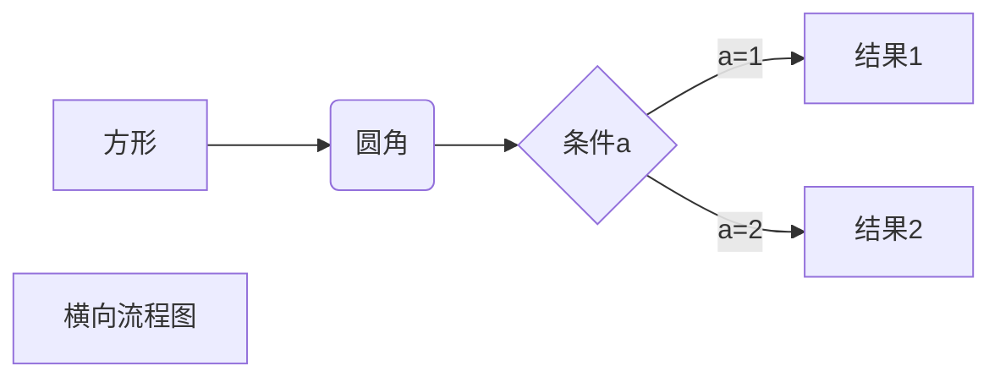
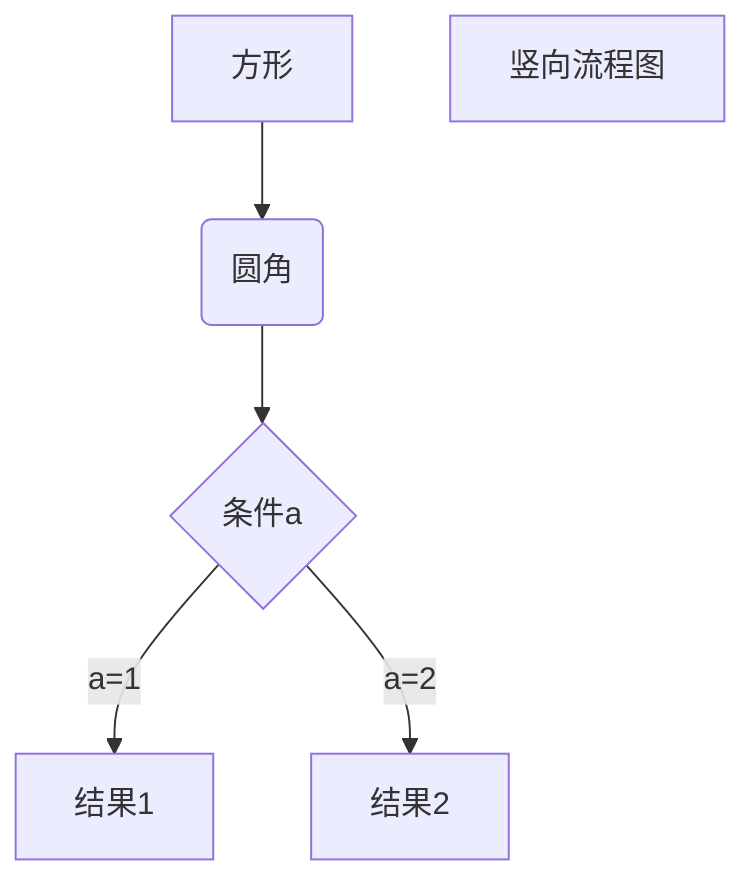
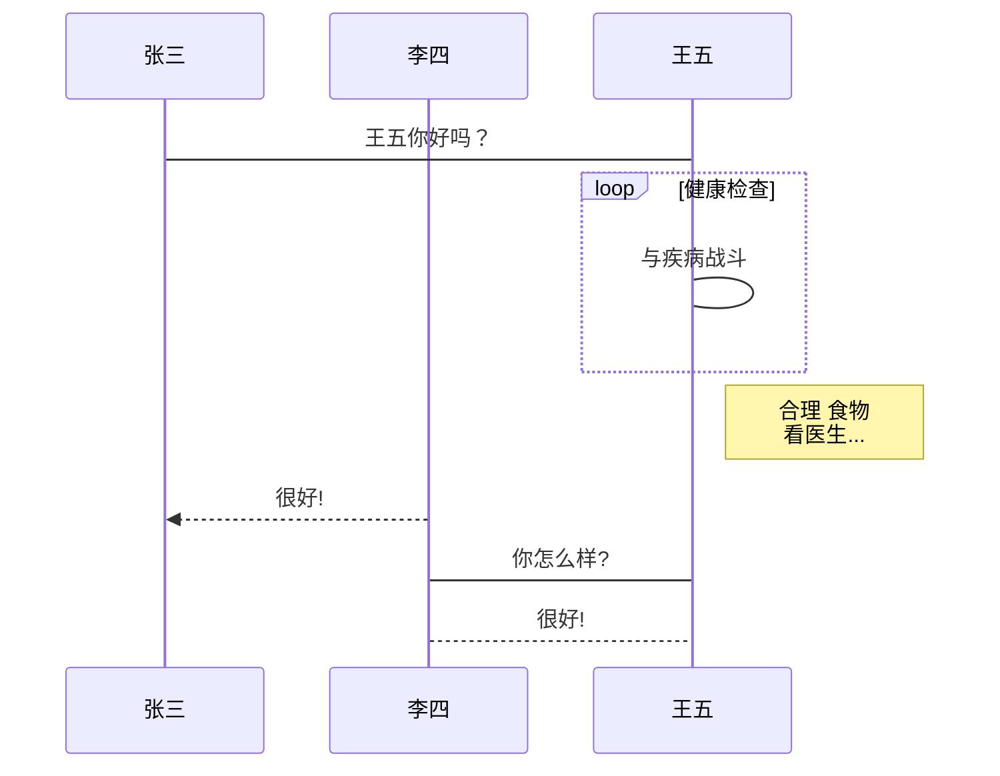
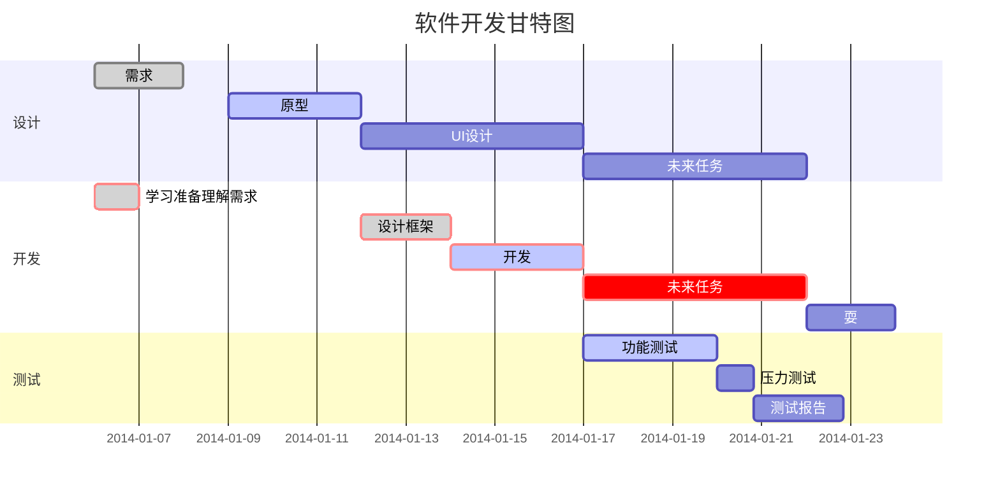
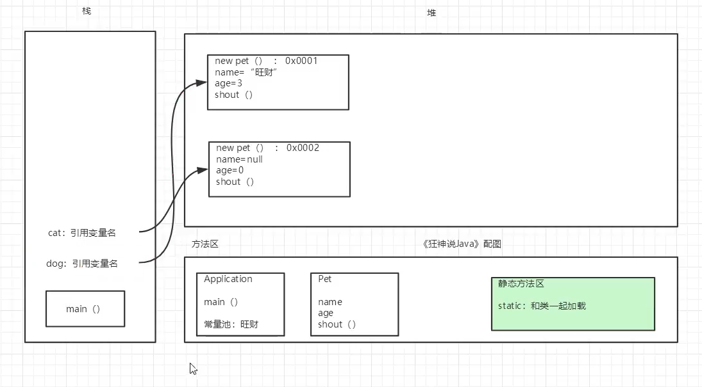
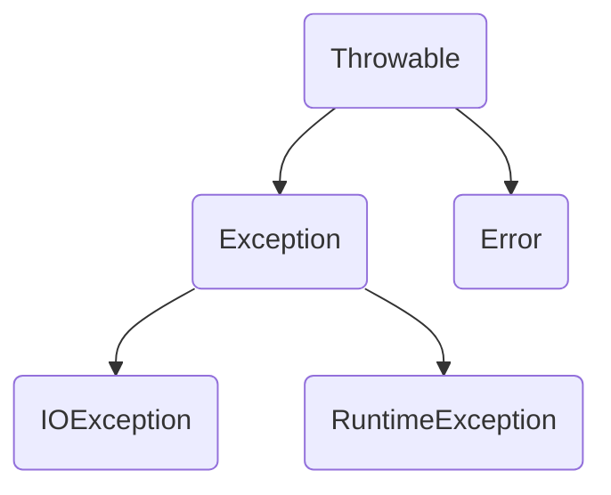

# JavaSE入门

## 1 前言

### 1.1 解决疑问

我觉得重要的点：

1. 要学习英语

2. 要坚持学习，最重要


### 1.2 学习路线

#### 总路线

| 学习内容    | 学习时间/天 |
| ----------- | ----------- |
| JavaSE      | 19          |
| 数据库      | 4           |
| 前端        | 7           |
| JavaWeb     | 7           |
| SSM框架     | 9           |
| Linux       | 7           |
| SpringBoot  | 8           |
| SpringCloud | 7           |
| Hadoop      | 8           |

#### JavaSE

1. 计算机基础
2. 博客的重要性
3. Java基础语法
4. 流程控制
5. 方法
6. 数组
7. 面向对象
8. 异常
9. 常用类
10. 集合框架
11. IO
12. 多线程
13. GUI
14. 网络编程
15. 注解和反射
16. JUC编程
17. JVM探究
18. 【扩展】设计模式
19. 【扩展】XML
20. 【扩展】数据结构与算法
21. 【扩展】正则表达式

#### 数据库

1. MySQL
2. JDBC
3. UML类图
4. 数据库设计

#### 前端

1. HTML
2. CSS
3. JS
4. jQuery
5. Layui/BootStrap
6. Vue

#### JavaWeb

1. Tomcat
2. Http
3. Maven
4. Servlet
5. Session
6. Cookie
7. JSP
8. 三层架构
9. JSTL，EL表达式
10. 过滤器
11. 监听器
12. 文件上传
13. 邮件收发
14. 【扩展】富文本编辑器

---

至此，做出一个网站已经没有问题了。

#### SSM框架

1. Git
2. MyBatis
3. Spring
4. SpringMVC

#### Linux 

1. Linux基础
2. Redis
3. Nginx
4. Docker

---

至此，去小公司上班已经足够了。

#### Spring Boot 

1. SpringBoot基础
2. SpringBoot配置及原理
3. SpringBoot持久化操作
4. SpringBoot Web开发
5. SpringBoot 缓存
6. SpringBoot 消息
7. SpringBoot 检索
8. SpringBoot 任务
9. SpringBoot 安全
10. Dubbo+Zookeeper 分布式开发

#### SpringCloud

1. 微服务及微服务架构
2. SpringCloud
3. Eureka服务注册与发现
4. Feign，Ribbon负载均衡
5. Hystrix 熔断机制
6. Zuul 路由网关
7. SpringCloud Config配置中心

#### Hadoop

1. 大数据时代
2. Hadoop简介
3. Hadoop环境搭建
4. HDFS
5. MapReduce
6. Yarn
7. Hive
8. Hbase

### 1.3 学习方法

多写**代码**，多写**笔记**，多写**文章**

(笔记自己看，文章练表达和文笔，加深理解同时给别人看)

多练**交流**，多练**思维，**多练**技能**

多分享**知识**，多提问**怎么了**，多思考**为什么**

---

最重要的是**坚持**

每个牛B人物背后都有端苦逼的岁月，只要像sb一样的坚持，终将牛B

## 2 预科

### 2.1 写博客的重要性

- 需要总结和思考。
- 提示文笔组织
- 提示逻辑思维
- 帮助别人，结交朋友

我们不能一直赶路，却忘记了放慢脚步

写博客短期内可能看不到效果，但是长期坚持下来一定会有所收获

### 2.2 MarkDown语法

#### 标题

分六级，不同数量的# + “ ”

#### 段落格式

**段落换行**

是使用两个以上的空格加回车换行

或使用一个空行

**字体**

*号和_线都可以用来表述字体

**分隔线**

三个以上的星号，减号，底线都可以

```markdown
***
* * *
---
___
```

**删除线**

两端加~~

**下划线**

可以通过HTML的<u>标签来实现

**脚注**

这样[^run]

[^run]: 奔跑  

```markdown
这样[^run]
[^run]:奔跑
```

#### 列表

**有序列表**

使用+ - * 皆可

**无序列表**

使用1. 

**列表嵌套**

前面加四个空格

Typora Ctrl + 空格嵌套列表

#### 区块

在段落的开头使用>后紧跟一个空格

使用不同数量的>来嵌套区块

也可以再区块里使用列表

列表里也可以使用区块

#### 代码

段落上的一个函数或片段的代码可以用反引号包起来`

四个空格或制表符Tab键

使用```并指定语言

#### 链接

```markdown
[链接名称](链接地址)
<链接地址>

这个链接使用1作为网络变量[Google][1]
并在文档的末尾为变量赋值

[1]:http://www.google.com
```

#### 图片

```markdown


```

使用HTML中标签来指定高度与宽度

#### 表格

使用|来分隔不同的单元格，使用-来分隔表头和去其他行

```markdown
|  表头   | 表头  |
|  ----  | ----  |
| 单元格  | 单元格 |
| 单元格  | 单元格 |

-: 设置内容和标题栏居右对齐。
:- 设置内容和标题栏居左对齐。
:-: 设置内容和标题栏居中对齐。

| 左对齐 | 右对齐 | 居中对齐 |
| :-----| ----: | :----: |
| 单元格 | 单元格 | 单元格 |
| 单元格 | 单元格 | 单元格 |
```

#### 高级技巧

支持HTML元素

转义字符

公式

当你需要在编辑器中插入数学公式时，可以使用两个美元符 $$ 包裹 TeX 或 LaTeX 格式的数学公式来实现

#### Typora画图

~~~markdown
Typora画流程图，时序图，甘特图
以下几个实例效果图如下：

1、横向流程图源码格式：


2、竖向流程图源码格式：


3、标准流程图源码格式：

```flow
st=>start: 开始框
op=>operation: 处理框
cond=>condition: 判断框(是或否?)
sub1=>subroutine: 子流程
io=>inputoutput: 输入输出框
e=>end: 结束框
st->op->cond
cond(yes)->io->e
cond(no)->sub1(right)->op
```
4、标准流程图源码格式（横向）：

```flow
st=>start: 开始框
op=>operation: 处理框
cond=>condition: 判断框(是或否?)
sub1=>subroutine: 子流程
io=>inputoutput: 输入输出框
e=>end: 结束框
st(right)->op(right)->cond
cond(yes)->io(bottom)->e
cond(no)->sub1(right)->op
```
5、UML时序图源码样例：

```sequence
对象A->对象B: 对象B你好吗?（请求）
Note right of 对象B: 对象B的描述
Note left of 对象A: 对象A的描述(提示)
对象B-->对象A: 我很好(响应)
对象A->对象B: 你真的好吗？
```
6、UML时序图源码复杂样例：

```sequence
Title: 标题：复杂使用
对象A->对象B: 对象B你好吗?（请求）
Note right of 对象B: 对象B的描述
Note left of 对象A: 对象A的描述(提示)
对象B-->对象A: 我很好(响应)
对象B->小三: 你好吗
小三-->>对象A: 对象B找我了
对象A->对象B: 你真的好吗？
Note over 小三,对象B: 我们是朋友
participant C
Note right of C: 没人陪我玩
```
7、UML标准时序图样例：


8、甘特图样例：


~~~

[点击进入Typora官网](https://www.typora.io)

### 2.3 Windows常用快捷键

Ctrl + A 全选

Ctrl + X 剪切

Ctrl + Z 撤销

Ctrl + S 保存

Alt + F4 关闭

Win + R 运行

Win + E 文件

Shift + Delete 永久删除

Ctrl + Shift +Esc 资源管理器

### 2.4 基本Dos命令

查看文件 dir

清理屏幕 cls

查看电脑ip ipconfig

---

打开应用

- 计算器 calc
- 画图 mspaint
- 记事本 notepad

文件

- md 创建目录
- rd 删除目录
- cd> 创建文件
- del 删除文件

## 3 简介

### 3.1 Java诞生

Java 是由 Sun公司于 1995 年 5 月推出的

后来 Sun 公司被 Oracle （甲骨文）公司收购

### 3.2 Java特性

- **Java 语言是简单的：**

  Java 语言的语法与 C 语言和 C++ 语言很接近，使得大多数程序员很容易学习和使用。另一方面，Java 丢弃了 C++ 中很少使用的、很难理解的、令人迷惑的那些特性，如操作符重载、多继承、自动的强制类型转换。特别地，Java 语言不使用指针，而是引用。并提供了自动分配和回收内存空间，使得程序员不必为内存管理而担忧。

- **Java 语言是面向对象的：**

  Java 语言提供类、接口和继承等面向对象的特性，为了简单起见，只支持类之间的单继承，但支持接口之间的多继承，并支持类与接口之间的实现机制（关键字为 implements）。Java 语言全面支持动态绑定，而 C++语言只对虚函数使用动态绑定。总之，Java语言是一个纯的面向对象程序设计语言。

- **Java语言是分布式的：**

  Java语 言支持 Internet 应用的开发，在基本的 Java 应用编程接口中有一个网络应用编程接口（java net），它提供了用于网络应用编程的类库，包括 URL、URLConnection、Socket、ServerSocket 等。Java 的 RMI（远程方法激活）机制也是开发分布式应用的重要手段。

- **Java 语言是健壮的：**

  Java 的强类型机制、异常处理、垃圾的自动收集等是 Java 程序健壮性的重要保证。对指针的丢弃是 Java 的明智选择。Java 的安全检查机制使得 Java 更具健壮性。

- **Java语言是安全的：**

  Java通常被用在网络环境中，为此，Java 提供了一个安全机制以防恶意代码的攻击。除了Java 语言具有的许多安全特性以外，Java 对通过网络下载的类具有一个安全防范机制（类 ClassLoader），如分配不同的名字空间以防替代本地的同名类、字节代码检查，并提供安全管理机制（类 SecurityManager）让 Java 应用设置安全哨兵。

- **Java 语言是体系结构中立的：**

  Java 程序（后缀为 java 的文件）在 Java 平台上被编译为体系结构中立的字节码格式（后缀为 class 的文件），然后可以在实现这个 Java 平台的任何系统中运行。这种途径适合于异构的网络环境和软件的分发。

- **Java 语言是可移植的：**

  这种可移植性来源于体系结构中立性，另外，Java 还严格规定了各个基本数据类型的长度。Java 系统本身也具有很强的可移植性，Java 编译器是用 Java 实现的，Java 的运行环境是用 ANSI C 实现的。

- **Java 语言是解释型的：**

  如前所述，Java 程序在 Java 平台上被编译为字节码格式，然后可以在实现这个 Java 平台的任何系统中运行。在运行时，Java 平台中的 Java 解释器对这些字节码进行解释执行，执行过程中需要的类在联接阶段被载入到运行环境中。

- **Java 是高性能的：**

  与那些解释型的高级脚本语言相比，Java 的确是高性能的。事实上，Java 的运行速度随着 JIT(Just-In-Time）编译器技术的发展越来越接近于 C++。

- **Java 语言是多线程的：**

  在 Java 语言中，线程是一种特殊的对象，它必须由 Thread 类或其子（孙）类来创建。通常有两种方法来创建线程：其一，使用型构为 Thread(Runnable) 的构造子类将一个实现了 Runnable 接口的对象包装成一个线程，其二，从 Thread 类派生出子类并重写 run 方法，使用该子类创建的对象即为线程。值得注意的是 Thread 类已经实现了 Runnable 接口，因此，任何一个线程均有它的 run 方法，而 run 方法中包含了线程所要运行的代码。线程的活动由一组方法来控制。Java 语言支持多个线程的同时执行，并提供多线程之间的同步机制（关键字为 synchronized）。

- **Java 语言是动态的：**

  Java 语言的设计目标之一是适应于动态变化的环境。Java 程序需要的类能够动态地被载入到运行环境，也可以通过网络来载入所需要的类。这也有利于软件的升级。另外，Java 中的类有一个运行时刻的表示，能进行运行时刻的类型检查。

### 3.3 Java三大版本

JavaSE 标准版

JavaME 嵌入式开发

JavaEE 企业级开发

### 3.4 JDK，JRE，JVM

JDK Java Development Kit

JRE Java Runtime Environment

JVM Java Virtual Machine

### 3.5 安装开发环境

下载JDK

配置环境变量

下载IDEA

### 3.6 编译型和解释型

Java编译 字节码 JVM解释

### 3.7 IDEA

我们的集成环境

#### 反编译

Java 编译 class 字节码文件

class 字节码文件 反编译 Java

IDEA 可以实现反编译 

将class文件在项目中打开可以看到反编译后的代码已经和我们写的有所区别

#### 快捷键

<kbd>Ctrl</kbd> + <kbd>D</kbd> 将本行代码复制到下一行

<kbd>Ctrl</kbd> + <kbd>H</kbd> 查看继承树

<kbd>Ctrl</kbd> + <kbd>Alt</kbd> + <kbd>T</kbd> 包裹代码块


## 4 基础

### 4.1 注释

comments

书写注释是非常好的习惯

Java中有三种注释

- 单行注释
- 多行注释
- 文档注释

```java
文档注释
/**
 * @Author lee
 */
```


### 4.2 标识符

- 类名，变量名，方法名都被称为标识符
- 标识符以字母，美元符，下划线开始
- 不能使用关键字作为方法名或者变量名...
- 大小写敏感
- 可以使用中文作为变量名，但不建议

### 4.3 关键字

事先定义的，有特别意义的标识符，有时又叫保留字

String 不是关键字，String是一个类

### 4.4 数据类型

**强类型语言**

要求变量的使用严格符合规范，所有变量先定义再使用

**弱类型语言**

没那么严格的要求，不必事先声明，变量的类型也可能会变化

**Java数据类型分为两大类：基本类型和引用类型**

#### 基本类型

*primitive type*

- 数值类型
  - 整数类型 byte 1，short 2，int 4，long 8  [字节]
  - 浮点类型 float 4，double 8   [字节]
  - 字符类型 char 2   [字节]
- 布尔类型 boolean 1   [位]

注意事项：

```java
long num = 30L //之后要加L 一般用大写以免混淆

float n = 50.1F //之后要加F 
```

**拓展**

整数拓展

- 二进制 0b
- 八进制 0
- 十进制 
- 十六进制 0x

浮点数拓展

```java
//银行面试题  业务里的钱怎么表示？
//使用BigDecimal 数学工具类

float f = 0.1F;   //0.1
double d = 0.1;   //0.1

System.out.println(f==d); //false
System.out.println(f);    //0.1
System.out.println(f);    //0.1

float f1 = 2323232323232323F;
float f2 = f1 + 1;
System.out.println(f==d); //true
```

- 浮点数是有限的，离散的，存在舍入误差，是一个约数
- 最好完全避免使用浮点数

字符拓展

- 字符本质是数字，可以转为数字
- 编码 Unicode
- 转义字符

类拓展 (此时，类还没有讲)

```java
//类
String sa = new String("hello world");
String sb = new String("hello world");

String sc = "hello world";
String sd = "hello world";

System.out.println(sa == sb); //false
System.out.println(sc == sd); //true
```

#### 引用类型

*reference type*

- 类
- 接口
- 数组

### 4.5 类型转换

强制转换：高到低

自动转换：低到高

byte，short，char ---> int ---> long ---> float ---> double

低---------------------------------------------------------------->高

注意点：

- 不能对boolean值进行转换
- 不能进行不相关类型的转换
- 高转低使用强制转换
- 可能存在溢出或精度问题

JDK7 新特性 数字之间可以使用下划线分割

```java
int money = 10_0000_0000;
System.out.println(money);//1000000000
```

### 4.6 变量常量

#### 变量

Variable

- 类型：必须声明类型
- 变量名：必须是合法的标识符
- 作用域：变量的有效范围

变量可以分为三类：

- 类变量：独立于方法之外的变量，用 static 修饰。
- 实例变量：独立于方法之外的变量，不过没有 static 修饰。从属于对象，如果不初始化就是类型的默认值。
- 局部变量：类的方法中的变量。

```java
public class Variable{
    static int allClicks=0;    // 类变量
 
    String str="hello world";  // 实例变量
 
    public void method(){
 
        int i =0;  // 局部变量
 
    }
}
```

#### 常量

Constant

- 初始化(initialize)之后不能再改变其值

- 其变量名一般用大写

- 使用final关键字来定义

- final是一个修饰符，修饰符不存在先后顺序

#### 命名规范

- 变量，方法，类名：见名知意
- 常量：大写字母和下划线
- 类名：首字母大写和驼峰原则
- 类成员变量：首字母小写和驼峰原则
- 局部变量：首字母小写和驼峰原则
- 方法名：首字母小写和驼峰原则

### 4.7 运算符

- 算术运算符：+,-,*,/,%,++,--
- 关系运算符：>,<,>=,<=,==,!=
- 位运算符: &,|,^,~,<<,>>,>>>
- 逻辑运算符: &&,||,!
- 赋值运算符: = ,*= ......
- 其他运算符: ?:,instanceof

运算符优先级

### 4.8 包机制

为了更好地组织类，Java提供了包机制，用于区别类的命名空间

包语句的语法格式:

```java
package pkg1[. pkg2[. pkge ...]];
```

一般用公司的域名倒置作为包名

使用import导入包

```java
import package1[.package2...].(classname|*);
```

### 4.9 JavaDoc

JavaDoc命令是用来生成自己的API文档的

#### 参数信息

- @author 作者名
- @version 版本号
- @since 需要指明最早使用的JDK版本
- @param 参数名
- @return 返回值情况
- @throws 异常抛出情况

#### 命令行生成

```bash
javadoc -encoding UTF-8 -charset UTF-8 DocTest.java
```

#### IDEA生成

Tools: Generate JavaDoc

Output directory: select folder

Local: zh_CN

Other command line arguments: -encoding utf-8 -charset utf-8

## 5 流程控制

### 5.1 用户交互

Java为我们提供了用于程序和用户交互的一个工具类，我们可以获取用户输入。java.util.Scanner是Java5的新特性，我们可以使用Scanner来获取用户的输入。

#### 基本语法

```java
Scanner scanner = new Scanner(System.in);
```

我们可以通过Scanner类的next()与nextLine()方法来获取输入的字符串。

一般来说，我们需要在使用前通过hasNext()和hasNextLine()来判断是否还有输入的数据。

```java
//凡是属于IO流的类，如果使用完不关闭会一直占用资源
scanner.close();
```

#### next()方法

1. 一定要读取到有效字符后才会结束输入
2. 对于有效字符之前的空白，next方法会自动将其去掉
3. 对于有效字符之后的空白，next方法将其视为分隔符或结束符
4. 所以next方法无法得到含空格的字符串

#### nextLine()方法

1. 以Enter作为结束符，返回的是按下Enter之前的字符串
2. 可以获得含空格的字符串

#### Scanner进阶

```java
Scanner scanner = new Scanner(System.in);
//Scanner还有许多方法用来接受各种类型的数据
scanner.nextInt();
scanner.nextFloat();
```

### 5.2 顺序结构

基本结构，没有特殊声明就顺序一条一条执行

### 5.3 选择结构

#### if

单选择 if

双选择 if else

多选择 

嵌套

#### switch

多选择

switch case 语句判断一个变量与一系列值中的某一个是否相等，每个值称为一个分支。

其中的变量类型可以是

- byte，short，int，char
- 从Java SE7 开始支持String
- case标签必须为字符串常量或字面量

```java
int i = 10;
switch(i){
	case 1:
	//语句
	break;
	
	case 2:
	//语句
	break;
	
	default: 
	//语句
}
```

#### break

跳出

#### continue

跳过本次

#### goto

goto虽然是Java的保留字，但是没有在正式语言中得到应用

Java没有goto

**带标签的break和continue**

标签：标识符后面跟一冒号 如：lable:

break,continue通常只中断当前循环，随标签一起使用会中断到标签处

> 对于Java来说唯一用到标签的地方是在循环语句之前。在循环语句之前设置标签的唯一理由是：我们希望在其中嵌套另一个循环。
>
> ```java
> int count = 0;
> 
> //输出101 到 150 之间的所有素数
> outer: for (int i =101;i<150;i++){
> 	for (int j=2;j<i/2;j++){
> 		if(i%j==0)
> 			continue outer;
> 	}
>  System.out.println(i + " ");
> }
> ```

### 5.4 循环结构

#### while

```java
while(i<100){
	System.out.println(i++);
}
```

#### do...while

```java
do{
	System.out.println(i++);
}while(i<100)
```

相比于while循环，即使条件不满足也会执行一次，即do...while保证代码至少也会执行一次

#### for

```java
for(int i=0;i<100;i++){
	System.out.println(i);
}
```

for更适合循环次数在执行前就已经知道的情况，如果不知道可以使用while或者do...while

#### 增强for

主要用于遍历数组和集合对象

```java
for(int number:numbers){
    System.out.println(number);
}
```

### 5.5 练习

打印九九乘法表

```java
for (int i = 1;i <=9;i++){
	for(int j = 1;j<=i;j++){
		System.out.print(i+ "*"+j+"="+i*j+"\t");
	}
	System.out.println();
}
```

打印三角形

```java
public class Triangle {
    public static void main(String[] args) {
        for (int i = 1; i <= 5; i++) {
            for (int j = 5;j>=i;j--){
                System.out.print(" ");
            }
            for (int j = 1;j<=i;j++){
                System.out.print("*");
            }
            for (int j = 1;j<i;j++){
                System.out.print("*");
            }

            System.out.println();
        }
    }
}
```

## 6 方法

### 6.1 什么是方法

Java方法是语句的集合，放在一起完成一个功能

解决一个问题的步骤的有序组合

方法设计原则

一个方法只完成一个功能 方法的原子性

### 6.2 方法的定义及调用

#### 方法的定义

方法包含一个方法头和一个方法体

- **修饰符：**修饰符，这是可选的，告诉编译器如何调用该方法。定义了该方法的访问类型。
- **返回值类型 ：**方法可能会返回值。returnValueType 是方法返回值的数据类型。有些方法执行所需的操作，但没有返回值。在这种情况下，returnValueType 是关键字**void**。
- **方法名：**是方法的实际名称。方法名和参数表共同构成方法签名。
- **参数类型：**参数像是一个占位符。当方法被调用时，传递值给参数。这个值被称为实参或变量。参数列表是指方法的参数类型、顺序和参数的个数。参数是可选的，方法可以不包含任何参数。
- **方法体：**方法体包含具体的语句，定义该方法的功能。

>修饰符 返回值类型 方法名(参数类型 参数名){
>
>​	...    
>
>​	方法体    
>
>​	...    
>
>​	return 返回值; 
>
>}

#### 方法的调用

调用方法：对象名.方法(实参列表)

Java支持两种调用方法

- 当方法有返回值时，方法调用通常被当作一个值

  ```java
  int larger = max(30,40);
  ```

- 当方法返回值为void时，方法调用是一条语句

  ```java
  System.out.println("Hello world!");
  ```

##### 值传递

值传递(pass by value)是指在调用方法时将实际参数**复制**一份传给方法，这样在方法中对**参数**进行修改将不会影响到参数

Java是值传递

##### 引用传递

引用传递(pass by reference)是指在调用方法时将实际参数的地址**直接**传给方法，这样在方法中对**参数**进行修改将会影响到参数

##### 区别

根本区别：是否创建副本(copy)

值传递和引用传递的区别并不是传递的内容。而是实参到底有没有被复制一份给形参。在判断实参内容有没有受影响的时候，要看传的的是什么，如果你传递的是个地址，那么就看这个地址的变化会不会有影响，而不是看地址指向的对象的变化。就像钥匙和房子的关系。

你有一把钥匙，当你的朋友想要去你家的时候，如果你直接把你的钥匙给他了，这就是引用传递。这种情况下，如果他对这把钥匙做了什么事情，比如他在钥匙上刻下了自己名字，那么这把钥匙还给你的时候，你自己的钥匙上也会多出他刻的名字。
你有一把钥匙，当你的朋友想要去你家的时候，你复刻了一把新钥匙给他，自己的还在自己手里，这就是值传递。这种情况下，他对这把钥匙做什么都不会影响你手里的这把钥匙。

但是不管上面的情况，如果你的朋友拿着你给他的钥匙进你家，把电视砸了，这就产生影响了。但钥匙还是钥匙，判断值传递还是引用传递时，你看的是钥匙，而不是房子里的其他东西。

**注意：**

关于Java值传递，引用传递的相关知识在面试中也经常会被问到，注意理解。

### 6.3 方法重载

#### 什么是重载

在一个类中，方法名相同，但是参数不同

#### 重载规则

- 方法名必须相同
- 参数列表必须不同
  - 参数个数不同
  - 参数类型不同
  - 参数排列顺序不同
- 方法返回类型可以相同也可以不同
- 仅仅返回值类型不同不能成为方法的重载

### 6.4 命令行传参

运行程序前再传参数给它，传递命令行参数给main()函数实现

```java
public class CommandLine {
   public static void main(String args[]){ 
      for(int i=0; i<args.length; i++){
         System.out.println("args[" + i + "]: " + args[i]);
      }
   }
}
```

运行这个程序，结果如下所示：

```bash
$ javac CommandLine.java 
$ java CommandLine this is a command line 200 -100
args[0]: this
args[1]: is
args[2]: a
args[3]: command
args[4]: line
args[5]: 200
args[6]: -100
```

### 6.5 可变参数

JDK 1.5 开始，Java支持传递同类型的可变参数给一个方法。

方法的可变参数的声明如下所示：

> typeName... parameterName

一个方法中只能指定一个可变参数，它必须是方法的最后一个参数。

```java
public class VarargsDemo {
    public static void main(String args[]) {
        // 调用可变参数的方法
        printMax(34, 3, 3, 2, 56.5);
        printMax(new double[]{1, 2, 3});
    }
 
    public static void printMax( double... numbers) { // 可变参数
        if (numbers.length == 0) {
            System.out.println("No argument passed");
            return;
        }
 
        double result = numbers[0];
 
        for (int i = 1; i <  numbers.length; i++){
            if (numbers[i] >  result) {
                result = numbers[i];
            }
        }
        System.out.println("The max value is " + result);
    }
}
```

### 6.6 递归

#### 什么是递归

方法自己调用自己

递归可以用来将一些复杂大规模问题转换成一些小规模类似问题

递归可以写成循环

#### 递归结构

- 递归头：什么时候不调用自身，即规模小到可以直接解决。没有的话会死循环。
- 递归体：什么时候调用自身。

能不用递归就不用递归，栈的空间使用完就会出错。

## 7 数组

### 7.1 数组概述

数组是**相同类型**数据的**有序**集合

可以通过下标来访问，下标从0开始

### 7.2 数组创建

#### 声明创建

首先必须声明数组变量，才能在程序中使用数组。下面是声明数组变量的语法：

> dataType[] arrayRefVar;   // 首选的方法
>
> dataType arrayRefVar[];  // 效果相同，但不是首选方法

Java语言使用new操作符来创建数组，语法如下：

> arrayRefVar = new dataType[arraySize];

上面的语法语句做了两件事：

1. 使用 dataType[arraySize] 创建了一个数组。
2. 把新创建的数组的引用赋值给变量 arrayRefVar。

当然也可以使用一行代码完成声明和创建：

```java
int[] numbers = new int[100];
```

可以通过numbers.length获取长度

#### 初始化

有三种初始化

- 静态初始化：

  ```java
  int[] numbers = {1,2,3};
  Person[] people = {new Person(),new Person()};
  ```

- 动态初始化：包含默认初始化

  ```java
  int[] numbers = new int[10];
  b[0] = 1;
  ```

- 默认初始化：数组是引用类型，其中的元素相当于类的实例变量，因此数组一经分配空间，其中的元素就按照实例变量同样的方式被隐式初始化。

#### 内存分析

Java内存分为：

- 堆：存放new的对象和数组
- 栈：存放基本变量类型，包括具体数值。存放引用对象的变量，包括具体地址。
- 方法区：包含所有class和static变量，方法区是特殊的堆。

声明数组时，数组并不存在，只是在栈中压入一个变量

创建数组时，数组才会存在，在堆中真正地开辟出空间

#### 下标越界

访问下标超出数组大小会产生下标越界异常。

#### 基本特点

- 长度确定
- 相同类型
- 元素可以是任意的类型
- 数组是引用类型，数组可以看成是对象，Java中的对象保存在堆中，无论数组对象中存什么数据类型，数组所占空间是在堆中的，返回的引用是在栈里的。引用：栈--->堆

### 7.3 数组使用

- 使用for循环
- 使用for-each循环即增强型for
- 使用数组作为方法的参数
- 使用数组作为返回值

### 7.4 多维数组

数组的元素还是数组

```java
int[][] nums = new int[2][5];
int[][] numbers = {{1,2},{3,4},{5,6}};
```

### 7.5 Arrays类

数组的工具类java.util.Arrays

Arrays类中的方法都是static修饰的静态方法，可以直接使用类名调用

有以下常用功能

- 给数组赋值：通过 fill 方法。
- 对数组排序：通过 sort 方法,按升序。
- 比较数组：通过 equals 方法比较数组中元素值是否相等。
- 查找数组元素：通过 binarySearch 方法能对排序好的数组进行二分查找法操作。

### 7.6 冒泡排序

```java
public static void sort(int[] array){
	for(int i=0;i<array.length-1;i++){
        
        boolean flag = false;//优化，跳过没有意义的比较轮次
        
        //减i是因为进行i次比较后，产生了i个最大或最小的数不需要进行下次比较
        for(int j=0;j<array.length-1-i;j++){
            if(array[j+1]<array[j])
                swap(array[j+1],array[j]);
        }
        if(flag == flase)
            break;
    }
}
```

### 7.7 稀疏数组

数组中大部分为0，或其他相同元素时，采用的一种压缩存储方式。

即只记录数组行列等基本信息，以及有效信息

## 8 面向对象

### 8.1 初识面向对象

面向过程

面向对象

以类的方式组织代码，以对象的方式封装数据

### 8.2 方法

回顾：如何定义方法

静态方法：可以通过类名调用

非静态方法：需要实例化对象，借用对象调用

形参实参

值传递引用传递

this关键字：用来表示当前对象本身，或当前类的一个实例，通过 this 可以调用本对象的所有方法和属性。

### 8.3 对象创建分析

使用new创建对象，创建时会

- 分配内存空间
- 默认初始化
- 调用构造方法

构造方法

- 方法名和类名相同
- 没有返回类型，不能写成void

一旦定义了有参构造，无参构造就必须显式定义

new本质是在调用构造器

内存分析



### 8.4 三大特性

#### 封装

高内聚，低耦合

- 模块内部联系紧密
- 模块之间联系松散

封装：数据的隐藏，将数据封装起来，只暴露给外界接口

属性：private

方法：getter/setter

封装的优点：

- 良好的封装能够减少耦合。
- 类内部的结构可以自由修改。
- 可以对成员变量进行更精确的控制。
- 隐藏信息，实现细节。

#### 继承

继承是类于类之间的关系，除此之外类与类之间的关系还有依赖，组合，聚合。继承：is a关系

Java只有单继承

**控制访问与继承的规则**：

- 父类中声明为 public 的方法在子类中也必须为 public。
- 父类中声明为 protected 的方法在子类中要么声明为 protected，要么声明为 public，不能声明为 private。
- 父类中声明为 private 的方法，不能够被继承。

**Object类**

在Java中，所有的类都继承了Object类

**super关键字**：表示当前类的父类

- super调用父类的构造方法，必须在父类方法的第一个
- super只能出现在子类方法或者是构造方法中
- super和this不能同时调用构造方法

一般在写了带参数构造器后，都需要显式写出无参构造器

**方法重写**

重写是方法的重写与属性无关

静态方法：方法调用只和定义时的类有关，其实是通过类名在调用

非静态方法：重写，用实例化对象调用

父类

```java
public class A {
    public static void test_static(){
        System.out.println("A=>test_static");
    }

    public void test(){
        System.out.println("A=>test");
    }
}
```

子类

```java
public class B extends A{
    public static void test_static(){
        System.out.println("B=>test_static");
    }

    @Override
    public void test(){
        System.out.println("B=>test");
    }
}
```

测试

```java
public class test {
    public static void main(String[] args) {

        B b = new B();
        A a= new B();

        b.test_static();
        a.test_static();

        a.test();
        b.test();
    }
}
```

输出

```bash
B=>test_static
A=>test_static
B=>test
B=>test
```

总结

- 重写需要有继承关系，子类重写父类的关系
- 方法名相同
- 参数列表相同
- 修饰符：范围可以扩大但不能缩小
  - 父类是protected子类改为public
- 异常：可以缩小但不能扩大
  - 父类是Exception子类是ClassNotFoundException

不能重写的方法

- static方法属于类，不属于实例
- final修饰的方法
- private 私有的方法无法重写

不能继承的类

- 被final修饰的类

#### 多态

动态编译：类型在执行时才能确定

同一方法可以根据发送对象的不同而采用多种不同的行为方式

一个对象的实际类型是确定的

但可以指向的引用类型就不一定了，父类引用可以指向子类的对象

父类

```java
public class Person {
    public void run(){
        System.out.println("run");
    }
}
```

子类

```java
public class Student extends Person{
    public void eat(){
        System.out.println("eat");
    }

    @Override
    public void run() {
        System.out.println("sonRun");;
    }
}
```

测试

```java
public class Test {
    public static void main(String[] args) {

        Student s1 = new Student();
        Person s2 = new Student();

        s1.run();//两个类型都有run方法且子类重写，执行子类的
        s2.run();

        s1.eat();//eat方法是子类独有的，父类无法调用
        //s2.eat();//报错
    }
}
```

输出

```bash
sonRun
sonRun
eat
```

总结：

多态是方法的多态，属性没有多态

多态存在条件：

1. 有继承关系
2. 子类重写父类的方法
3. 父类引用指向子类对象

多态的实现可以有以下几种：

1. 重写
2. 接口
3. 抽象类和抽象方法

### 8.5 instanceof

判断一个类型是不是某种类型

A instanceof B

看A和B有没有继承关系，

同级别类是无法通过编译的

### 8.6 类型转换

引用类型转换

同样的高转低要强制转换

低转高是直接实现可以的

如果子类转为父类就可能会丢失一些子类自己本来的方法

子类转父类 向上转型

父类转子类 向下转型 强制转换

### 8.7 static

static变量

static变量也称作静态变量，静态变量和非静态变量的区别是：静态变量被所有的对象所共享，在内存中只有一个副本【存放在方法区】，它当且仅当在类初次加载时会被初始化【加final和不加final的static变量初始化的位置不一样】。而非静态变量是对象所拥有的，在创建对象的时候被初始化，存在多个副本，各个对象拥有的副本互不影响。

static方法

static方法一般称作静态方法，由于静态方法不依赖于任何对象就可以进行访问，因此对于静态方法来说，是没有this的，因为它不依附于任何对象，既然都没有对象，就谈不上this了。并且由于这个特性，在静态方法中不能访问类的非静态成员变量和非静态成员方法，因为非静态成员方法/变量都是必须依赖具体的对象才能够被调用。

static静态代码块

static关键字还有一个比较关键的作用就是 用来形成静态代码块以优化程序性能。static块可以置于类中的任何地方，类中可以有多个static块。在类初次被加载的时候，会按照static块的顺序来执行每个static块，并且只会执行一次【根据class加载原理 每个类加载一次 使用双亲委托加载】。

**初始化的顺序 静态代码块 > 构造代码块 > 构造函数** 

测试

```java
public class Test {
    {
        System.out.println("匿名代码块");
    }

    static{
        System.out.println("静态代码块");
    }

    public Test(){
        System.out.println("构造方法");
    }

    public static void main(String[] args) {
        Test test = new Test();
        System.out.println("=========");
        Test test2 = new Test();
    }
}
```

执行

```bash
静态代码块
匿名代码块
构造方法
=========
匿名代码块
构造方法
```

static块可以用来优化程序性能，是因为它的特性:只会在类加载的时候执行一次，之后会按匿名代码块，构造方法的顺序执行

很多时候会将一些只需要进行一次的初始化操作都放在static代码块中进行。

静态内部类

​    pass

静态导包

```java
import static java.lang.Math.random;//下面使用时可以直接调用random()
```

### 8.8 抽象类

abstract修饰符可以修饰方法也可以修饰类，abstract修饰方法就是抽象方法，abstract修饰类就是抽象类。

抽象类中可以没有抽象方法，但是一旦定义的抽象方法就必须声明为抽象类。抽象类也可以写普通方法。

抽象类：不能实例化，不能new，它就是用来让别人继承的

抽象方法：只有方法的声明，没有实现，子类需要实现。

子类继承抽象类就需要实现抽象方法，否则它也应当声明为抽象类

---

但是抽象类本质还是一个类，别人需要用extends继承，但是Java只有单继承

这是需要引入接口，接口可以实现多继承

思考：抽象类也存在构造器

### 8.9 接口

接口：只有规范。可以实现约束和实现分离--->面向接口编程

接口就是规范，定义的是一组规则。体现的是现实世界中“如果你是...则必须能...”的思想

接口的本质是契约，像法律，制定好了大家都要遵守

面向对象的精髓，是对对象的抽象，最能体现这一点的就是接口。

设计模式其实就是在研究：如何合理地去抽象

---

接口中定义方法都是抽象的，而且默认是public abstract，可以不写

接口中定义的属性都是常量，默认public static final，一般没人在接口里定义属性

使用接口时要注意锻炼自己的抽象思维能力

总结

1. 接口是约束
2. 接口定义一些方法，让不同的人实现
3. 接口方法默认是public abstract
4. 接口属性默认是public static final
5. 接口不能被实例化，接口也没有构造方法
6. implements可以实现多个接口

### 8.10 内部类

内部类就是在类的内部再定义一个类

一个java类可以有多个class，但只能有一个public class

- 成员内部类

- 静态内部类

- 局部内部类

- 匿名内部类


## 9 异常

### 什么是异常

程序运行时出现的不期而至的情况，文件找不到，网络链接失败等

要理解Java异常处理是如何工作的，你需要掌握以下三种类型的异常：

- **检查性异常：**最具代表的检查性异常是用户错误或问题引起的异常，这是程序员无法预见的。例如要打开一个不存在文件时，一个异常就发生了，这些异常在编译时不能被简单地忽略。
- **运行时异常：** 运行时异常是可能被程序员避免的异常。与检查性异常相反，运行时异常可以在编译时被忽略。
- **错误：** 错误不是异常，而是脱离程序员控制的问题。错误在代码中通常被忽略。例如，当栈溢出时，一个错误就发生了，它们在编译也检查不到的。

### 异常体系结构

所有的异常类是从 java.lang.Exception 类继承的子类。

Exception 类是 Throwable 类的子类。除了Exception类外，Throwable还有一个子类Error 。

Java 程序通常不捕获错误。错误一般发生在严重故障时，它们在Java程序处理的范畴之外。

Error 用来指示运行时环境发生的错误。

例如，JVM 内存溢出。一般地，程序不会从错误中恢复。

异常类有两个主要的子类：IOException 类和 RuntimeException 类。



#### Error

Error类对象由Java虚拟机生成并抛出，大多数错误与代码编写者执行的操作无关。

Error是灾难性的致命的错误，是程序无法控制和处理的

#### Exception

Exception通常是可以被程序处理的。我们应当尽量避免一些异常的产生。

### 捕获和抛出异常

抛出异常

捕获异常

五个关键字

try，catch，finally，throw，throws

主动抛出异常

一般在方法中使用。

```java
if(b == 0){
	throw new ArithmeticException();
}
```

在方法上抛出异常throws

```java
public void method(int a,int b) throws IOException{
    }
```

### 自定义异常

在 Java 中你可以自定义异常。编写自己的异常类时需要记住下面的几点。

- 所有异常都必须是 Throwable 的子类。
- 如果希望写一个检查性异常类，则需要继承 Exception 类。
- 如果你想写一个运行时异常类，那么需要继承 RuntimeException 类。

可以像下面这样定义自己的异常类：

```java
class MyException extends Exception{
    }
```

实例

```java
public class MyException extends Exception
{
  private int number;
  public MyException(int number)
  {
    this.number = number;
  } 
  @Override
  public String toString(){
  	return "MyException: "+number;
  }
}
```

## 10 总结

### 常用类

Object

Math

Random

File

包装类

Data类

String

StringBuffer

StringBuilder
