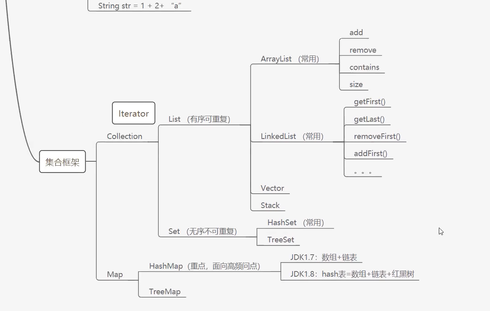

# JavaSE注意

1.

```java
//浮点数拓展
float f = 0.1F;   //0.1
double d = 0.1;//0.1

System.out.println(f==d); //false
System.out.println(f);    //0.1
System.out.println(f);    //0.1

float f1 = 2323232323232323F;
float f2 = f1 + 1;
System.out.println(f1==f2); //true
```

2.

```java
//类
String sa = new String("hello world");
String sb = new String("hello world");

String sc = "hello world";
String sd = "hello world";

System.out.println(sa == sb);//false
System.out.println(sc == sd);//true
```

//static关键字的内容已经可以写一篇文章

//static静态类

//值传递和应用传递也可以写一篇文章

//Java多态也可以单出一篇文章了

后面我打算学一下Java高级教程，另开一个文件，参考菜鸟教程和leetcode中的一些题目来书写

集合框架学习



1. 内存分析图
2. 《阿里巴巴Java开发手册》规范
3. 搜索 有趣的注释 
4. static静态类
5. typora画图

